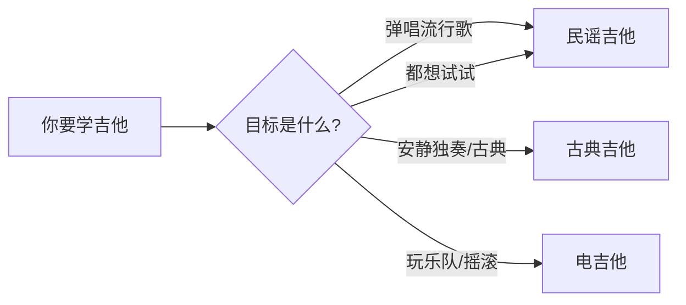
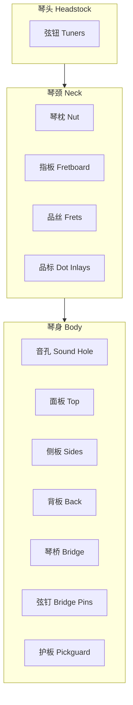
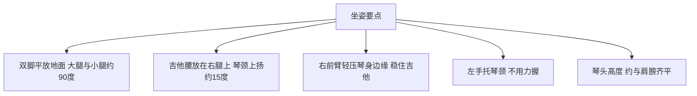
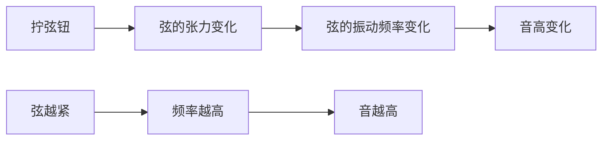

## 一、吉他的种类

第一次进琴行，墙上挂满各种吉他，很容易懵。先搞清楚分类，才能选对琴。

### 1.1 三大类吉他

| 类型 | 琴弦 | 音色特点 | 适合场景 |
|------|------|---------|---------|
| **古典吉他** | 尼龙弦 6 根 | 柔和、温暖、延音长 | 古典、弗拉门戈、指弹独奏 |
| **民谣吉他** | 钢弦 6 根 | 明亮、清脆、穿透力强 | 弹唱、流行、民谣 |
| **电吉他** | 钢弦 6 根（细） | 通过效果器变化无穷 | 摇滚、爵士、流行独奏 |



> **本教程以民谣吉他为主线**。原因：民谣吉他用途最广、入门门槛适中、弹唱指弹通吃。古典和电吉他在关键差异点会单独说明。

### 1.2 选琴建议（零基础）

| 预算 | 建议 |
|------|------|
| 500 元以下 | 能弹响就行，但音准和手感可能有问题，容易劝退 |
| 500-1000 元 | **推荐区间**，入门面单琴，音色手感都还过得去 |
| 1000-3000 元 | 全单或优质面单，可以用很久 |

**几个关键点：**

- **桶型** — 新手选 **D 桶（Dreadnought）**，音量大、低音足、最通用
- **尺寸** — 身高 160 以上用 41 寸标准款；150-160 用 40 寸；150 以下用 36-38 寸旅行款
- **琴弦** — 新手先用 **0.12-0.53 规格的磷铜弦**，比 0.13 轻，按着没那么痛

> **常见误区**：以为"便宜的琴不影响学习"。错。劣质琴弦距过高，按弦费力还按不响，会让你误以为自己没天赋。一把手感合格的琴比什么都重要。

---

## 二、吉他的结构

认识各部位名称，后面学任何技巧你才听得懂老师在说什么。

### 2.1 整体结构



### 2.2 各部位详解

#### 琴头部分

| 部位 | 作用 |
|------|------|
| **弦钮（Tuners）** | 调音用，拧动改变弦的张力从而改变音高 |
| **琴枕（Nut）** | 琴颈顶端的小槽，弦从这里开始振动 |

#### 琴颈部分

| 部位 | 作用 |
|------|------|
| **指板（Fretboard）** | 左手按弦的地方，通常玫瑰木或乌木 |
| **品丝（Frets）** | 指板上的金属横条，按在不同品丝之间发出不同音高 |
| **品标（Dot Inlays）** | 指板上的圆点标记，通常在 3、5、7、9、12、15、17、19 品 |

#### 琴身部分

| 部位 | 作用 |
|------|------|
| **音孔（Sound Hole）** | 声音的出口，面板振动通过音孔放大 |
| **面板（Top）** | 最重要的共振板，决定音色好坏（云杉/雪松最常见） |
| **琴桥（Bridge）** | 弦的另一端固定点，把弦的振动传给面板 |
| **弦钉（Bridge Pins）** | 固定琴弦到琴桥上 |

---

## 三、六根琴弦

### 3.1 弦的编号

吉他有 6 根弦，编号规则是**从下往上、从细到粗**：

```
最细（离地最近）  ← 第 1 弦（高音 E）
                  ← 第 2 弦（B）
                  ← 第 3 弦（G）
                  ← 第 4 弦（D）
                  ← 第 5 弦（A）
最粗（离地最远）  ← 第 6 弦（低音 E）
```

> **注意**：编号方向和视觉方向相反！新手最容易搞混。记住口诀：**"细的是 1，粗的是 6"**。

### 3.2 标准调弦

从第 6 弦到第 1 弦（粗→细），标准音高是 **E A D G B E**。

| 弦号 | 音名 | 唱名 |
|------|------|------|
| 6 弦 | E | 低音 Mi |
| 5 弦 | A | La |
| 4 弦 | D | Re |
| 3 弦 | G | Sol |
| 2 弦 | B | Si |
| 1 弦 | E | 高音 Mi |

> **记忆口诀**：从低到高 "EADGBE"，谐音 "鳄鱼爱吃狗饼干"——离谱但好记。

> **为什么是这个调弦？** 因为这 6 个音让相邻弦之间多数相隔四度（5 个半音），少数相隔三度（4 个半音）。这种排列让左手能用最少的移动按出常用和弦，是几百年来摸索出的最优解。

---

## 四、持琴姿势

姿势是一切的基础。姿势错了，不仅影响演奏，长期还会导致颈椎、腰椎、手腕问题。

### 4.1 坐姿（最常用）

#### 标准坐姿



**详细说明：**

| 部位 | 正确姿势 | 错误姿势 |
|------|---------|---------|
| **背部** | 挺直，不要驼背 | 弯腰低头看指板 |
| **肩膀** | 放松下沉 | 耸肩（紧张的表现） |
| **吉他位置** | 腰部放在右大腿上，琴颈微上扬 | 吉他平放或琴头下垂 |
| **右臂** | 自然搭在琴身最宽处，肘部不超出琴身边缘 | 死死压住吉他、肘部悬空 |
| **左手** | 拇指在琴颈背后中轴线，其余手指自然弯曲按弦 | 拇指从上面扣住琴颈 |
| **琴头高度** | 与左肩齐平或略高 | 低于胸口（琴头下沉） |

#### 为什么琴头不能下垂？

琴头下垂时：

1. **左手需要额外用力托住琴颈** — 该用力的地方是按弦的手指，而不是托琴颈的手腕
2. **重心靠后，吉他容易滑** — 你只能更用力夹住，导致前臂和肩膀僵硬
3. **看不清指板** — 视线被琴身挡住，只能低头弯腰

琴头上扬 15 度时，吉他重心落在右腿和右臂的支撑点之间，**左手几乎不需要用力就能保持平衡**。

### 4.2 古典坐姿（指弹推荐）

弹指弹或古典曲目时，标准坐姿不够稳，改用古典坐姿：

- 左腿踩脚凳抬高（或用吉他支架）
- 吉他腰放在**左腿**上
- 琴颈上扬角度更大（约 30-45 度）
- 吉他琴颈与身体呈约 45 度夹角


### 4.3 站姿

站姿弹唱时需要背带：

- **背带长度** — 吉他位置应与坐姿时大致相同（琴身下沿约在腰带位置）
- **不要挂太低** — 很多新手模仿摇滚明星把吉他挂得很低，看着酷但根本按不到弦
- **双脚** — 与肩同宽，重心稳定

> **关键原则**：无论坐还是站，**吉他的位置应该让你在不动肩膀的情况下，左手能轻松够到第 1 品**。

---

## 五、左手手型

左手手型决定了你按弦的效率、音色的干净程度，以及是否会受伤。

### 5.1 基本手型

想象手里握着一个网球——

1. **拇指** — 放在琴颈背面的中轴线上（约对准第 2 弦的位置），指腹贴琴颈
2. **食指/中指/无名指/小指** — 自然弯曲，指尖垂直按弦
3. **手腕** — 微微外翻，让手指能垂直落到指板上
4. **手心** — 与琴颈之间留出空间，不要贴死

### 5.2 按弦的三个要点

#### 要点 1：指尖按弦，不是指腹

- **指尖**（手指最前端，指甲下方那块肉）按弦 → 只压住目标弦，干净
- **指腹**（手指第一关节下面那块平的肉）按弦 → 容易碰到相邻弦，杂音

#### 要点 2：按在品丝旁边，不是中间

```
琴头方向                              琴身方向
  ←
  |----品丝----|----品丝----|----品丝----|
       ↑              ↑
     这里按        这里按
   （太靠后）    （最佳位置：靠近品丝但不超过）
```

- 按在**靠近品丝的位置**（琴身方向那侧）→ 省力、音准好
- 按在**两品中间** → 需要更大力度才能按响
- 按在**品丝上或超过品丝** → 声音发闷、发死

#### 要点 3：手指拱起，不碰相邻弦

每个按弦的手指都要拱起来，**只接触目标弦**。这是新手最容易犯的错——某个手指趴下去，压住了下面那根弦，导致那根弦弹不响。

### 5.3 拇指位置

| 场景 | 拇指位置 |
|------|---------|
| **按开放和弦（1-5 品）** | 琴颈背面中轴线，约对准 2-3 弦 |
| **按大横按（如 F 和弦）** | 略下移，提供更大反作用力 |
| **高把位独奏（10 品以上）** | 拇指可能滑到琴颈侧面甚至上方 |

> **关键**：拇指是"支点"，提供按弦的反作用力。它不参与按弦，但决定了其余四指的力量和灵活度。如果拇指扣到琴颈正面（从上往下抓），四指就无法拱起按弦了。

---

## 六、第一次调音

新琴到手、换新弦、或者放久了——都需要调音。弹一个音准不对的琴，练再多也是错的。

### 6.1 调音工具

| 工具 | 优缺点 |
|------|--------|
| **手机调音 App** | 免费、方便，推荐 "GuitarTuna" 或 "调音器" |
| **夹式调音器** | 30-50 元，通过感应琴身振动调音，环境嘈杂也能用 |
| **在线调音** | 浏览器搜 "online guitar tuner" |

### 6.2 调音步骤

1. 打开调音器，选择吉他模式
2. 拨响第 6 弦（最粗的），让弦充分振动
3. 看调音器显示：
   - 偏低（显示 - 或 Flat）→ **顺时针**拧弦钮
   - 偏高（显示 + 或 Sharp）→ **逆时针**拧弦钮
4. 当指针居中显示绿色 = 调准
5. 6 弦到 1 弦依次调一遍

> **新手必看**：调音时**每次只拧一点点**，边拧边拨弦听音高变化。新弦特别容易跑调，刚换的弦可能需要反复调几次才稳定。

### 6.3 调音的原理



- 张力↑ → 频率↑ → 音升高
- 张力↓ → 频率↓ → 音降低

---

## 七、本章练习

### 练习 1：认识琴弦

不看吉他，默写出 6 根弦的编号和音名。然后拿起吉他验证。

### 练习 2：持琴姿势

对着镜子调整坐姿，检查：
- [ ] 背部是否挺直？
- [ ] 琴头是否与肩齐平？
- [ ] 左手拇指是否在琴颈背面中轴线？
- [ ] 肩膀是否放松下沉？

保持正确姿势 5 分钟，感受吉他在身体上的平衡点。

### 练习 3：调音

每天拿起吉他的第一件事就是调音。养成习惯，让标准音高刻进你的耳朵。

---

## 八、常见误区与 FAQ

| 问题 | 解答 |
|------|------|
| 手指太短按不到弦 | 99% 是手型问题，不是手指长度问题。拱起手指、外翻手腕就能解决 |
| 琴弦离指板太远按不动 | 这是"弦距"过高，找琴行调整琴桥和琴枕高度即可 |
| 按弦手指疼 | 正常现象，2-3 周长茧后就不疼了。期间不要硬撑，疼到起泡要休息 |
| 必须剪指甲吗 | 左手必须剪短（否则指尖按不到弦），右手看你想用拨片还是指甲 |
| 一定要买新琴吗 | 二手琴可以，但前提是琴颈直、弦距合理、没有结构性损伤 |

---

## 小结

这一章没有教任何"弹奏"，但每个细节都决定了你后续能走多远：

- **选琴** — 手感比音色重要
- **结构** — 记住各部位名称，才能听懂后续教学
- **弦序** — 细的 1、粗的 6，标准调弦 EADGBE
- **姿势** — 琴头上扬、左手轻握、右臂轻压
- **手型** — 指尖按弦、靠近品丝、手指拱起
- **调音** — 每次弹琴前必做

下一章我们开始右手拨弦——让吉他真正发出声音。
