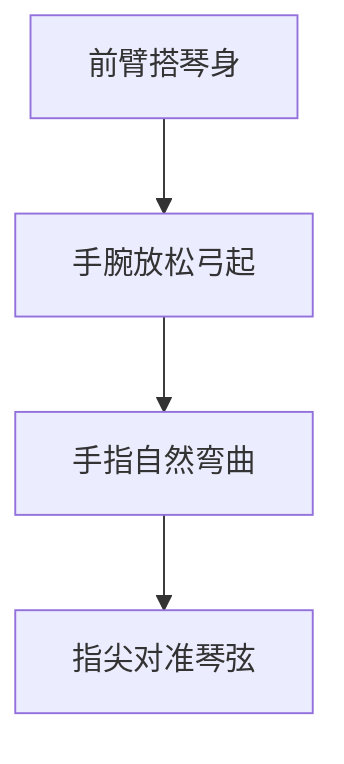
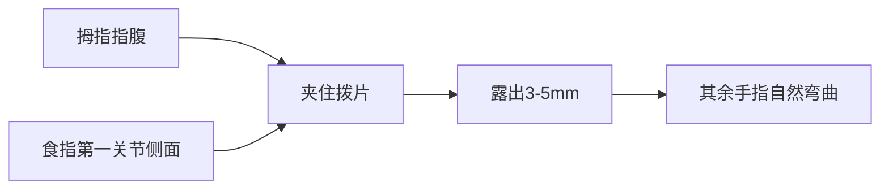
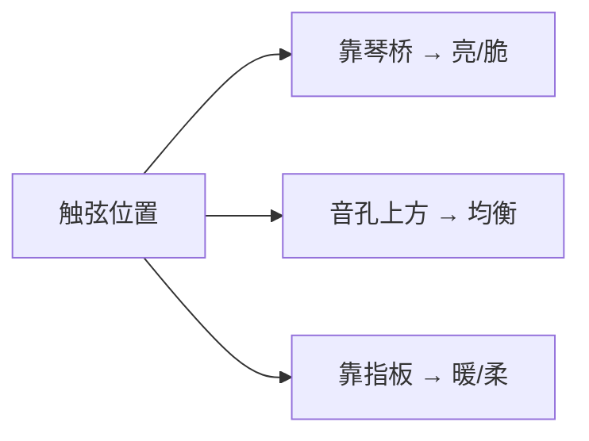

## 一、右手的基本姿势

右手决定了"声音好不好听"。同样的琴、同样的和弦，右手姿势不同，音色天差地别。

### 1.1 手臂位置

| 部位 | 位置 |
|------|------|
| **前臂** | 自然搭在琴身最宽处（腰部），作为支点 |
| **手腕** | 放松，略微弓起，与琴弦保持 2-3 厘米距离 |
| **手心** | 面向音孔方向，不要朝上翻 |
| **手指** | 自然弯曲，呈半握拳状 |



> **关键**：手腕一定要放松。僵硬的手腕会让拨弦变成"扯弦"，音色干涩无余韵。

### 1.2 右手位置区域

琴弦在不同位置拨动，音色完全不同：

```
琴桥方向 ←------- 琴弦 -------→ 琴颈方向
  脆、亮              温暖、柔
  靠琴桥              靠音孔
```

| 位置 | 音色特点 | 适用场景 |
|------|---------|---------|
| **靠琴桥（1-2cm）** | 明亮、尖锐、颗粒感强 | 扫弦节奏、节奏吉他 |
| **音孔正上方** | 均衡、饱满、最常用 | 通用 |
| **靠指板（音孔前）** | 温暖、柔和、低音足 | 指弹分解、抒情段落 |

---

## 二、拨片（Pick）拨弦

### 2.1 拨片选择

| 厚度 | 标记 | 特点 | 适合 |
|------|------|------|------|
| 0.46-0.60mm | Thin（薄） | 柔软、扫弦顺、音色暖 | 弹唱扫弦 |
| 0.73-0.80mm | Medium（中） | 万能 | 新手推荐 |
| 0.88-1.00mm | Heavy（厚） | 硬、颗粒感强、音色亮 | 独奏、电吉他 |
| 1.14mm 以上 | Extra Heavy | 极硬 | 速弹、金属 |

> **新手建议**：0.73mm 尼龙材质拨片，不滑手、声音不发飘。

### 2.2 握拨片的方法

1. 拇指与食指平行，拨片夹在两指指腹之间
2. 拨片露出 **3-5 毫米**（露出太多→灵活但软；露出太少→硬但卡弦）
3. 其余三指自然弯曲，不要攥拳



### 2.3 拨弦动作

拨弦不是"扯弦"，而是**斜向下扫过**：

| 错误 | 正确 |
|------|------|
| 把弦往外拉再弹回去 | 拨片以约 15-30 度角斜扫过弦 |
| 整个手臂动 | 手腕和小臂带动，手指基本不动 |
| 拨片垂直插入弦间 | 拨片倾斜，减少阻力 |

> **为什么拨片要倾斜？** 垂直插入时拨片会被弦卡住，需要更大力度才能过去，音色生硬。倾斜 15-30 度后，拨片能"滑过"琴弦，音色顺滑。

---

## 三、手指拨弦（指弹）

### 3.1 右手字母标记

指弹谱用字母标记手指：

| 标记 | 手指 | 英文名 |
|------|------|--------|
| **p** | 拇指 | pulgar |
| **i** | 食指 | índice |
| **m** | 中指 | medio |
| **a** | 无名指 | anular |

> **小指** 通常不用（除非弗拉门戈的轮指技巧）。

### 3.2 负责的琴弦

标准指法分工（非强制，但最常用）：

| 手指 | 负责弦 |
|------|--------|
| p（拇指） | 6、5、4 弦（低音三弦） |
| i（食指） | 3 弦 |
| m（中指） | 2 弦 |
| a（无名指） | 1 弦 |

### 3.3 两种触弦方式

#### A. 指肉拨弦（肉拨）

- 用指尖左侧的肉拨弦
- 音色柔和、温暖
- 适合古典、抒情指弹

#### B. 指甲拨弦（甲拨）

- 用指甲外侧扫过琴弦
- 音色明亮、颗粒感强
- 适合现代指弹、伴奏

> **混合方式（最常用）**：指肉先接触弦，指甲随后滑过——既柔和又清晰。这是大多数指弹演奏者的选择。

### 3.4 靠弦法 vs 勾弦法

| 方法 | 动作 | 音色 | 难度 |
|------|------|------|------|
| **靠弦法（Apoyando）** | 拨完弦后手指停靠在相邻弦上 | 饱满、有力 | 简单 |
| **勾弦法（Tirando）** | 拨完弦后手指悬空 | 轻盈、灵活 | 较难 |

新手先练靠弦法，建立发力感觉后再练勾弦法。

---

## 四、音色控制的三个维度

掌握以下三个变量，你就能"调"出想要的音色：

### 4.1 触弦点



### 4.2 力度

| 力度 | 音色 | 应用 |
|------|------|------|
| 轻（拨片刚过弦） | 细腻、余韵长 | 抒情分解 |
| 中 | 饱满、平衡 | 通用 |
| 重 | 响亮但略噪 | 强拍、扫弦高潮 |

> **注意**：超过某个临界点后，再用力只会增加杂音，不会增加音量。要追求"清脆"而非"响"。

### 4.3 角度

| 拨片角度 | 音色 |
|---------|------|
| 平行琴弦 | 闷、干 |
| 倾斜 15-30° | 顺滑（推荐） |
| 倾斜 45°+ | 软、有"沙沙"声 |

---

## 五、本章练习

### 练习 1：空弦拨奏（拨片）

用拨片依次拨响 6→5→4→3→2→1 弦，每弦拨 4 次：

```
6弦: ▼ ▼ ▼ ▼
5弦: ▼ ▼ ▼ ▼
...
1弦: ▼ ▼ ▼ ▼
```

要求：
- 每个音干净、无杂音
- 力度均匀
- 分别在"靠琴桥""音孔上方""靠指板"三个位置拨，听音色差异

### 练习 2：指弹交替

用 i、m 指交替拨第 1 弦：

```
i m i m i m i m
▼ ▼ ▼ ▼ ▼ ▼ ▼ ▼
```

要求：速度均匀，两指力度一致。

### 练习 3：p 指低音练习

拇指依次拨 6→5→4→5 弦，循环：

```
6  5  4  5  | 6  5  4  5
p  p  p  p  | p  p  p  p
```

---

## 六、常见误区与 FAQ

| 问题 | 原因 | 解决 |
|------|------|------|
| 拨片总是滑 | 手指出汗 | 用尼龙材质拨片，或手指蘸一点松香 |
| 音色发闷 | 拨片垂直插入 | 倾斜 15-30 度 |
| 拨弦有"啪"的杂音 | 拨片插太深 | 露出 3-5mm 即可 |
| 手腕酸痛 | 用手臂带动拨弦 | 改用手腕发力 |
| 指弹声音太小 | 没用指甲 | 留 1-2mm 指甲，或用指肉+指甲混合 |

---

## 小结

- **右手位置**：靠琴桥亮、靠指板暖
- **拨片**：0.73mm 起步，倾斜 15-30°，露出 3-5mm
- **指弹分工**：p→低音弦，i/m/a→高音弦
- **音色三要素**：触弦点、力度、角度

下一章进入左手——按弦与指力训练。
