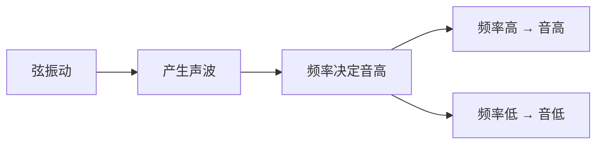
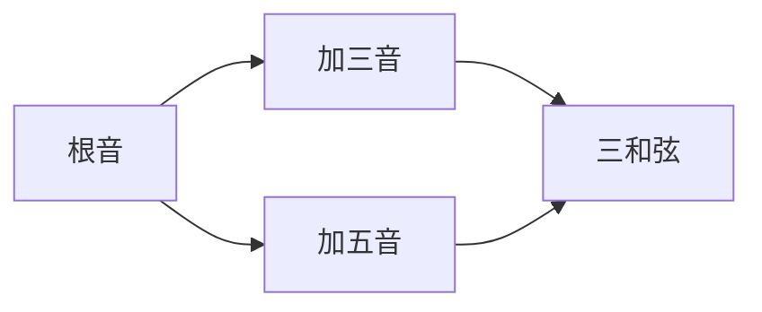

## 一、声音的本质

### 1.1 什么是音高

声音是物体振动产生的波。振动越快（频率越高），音越高；振动越慢（频率越低），音越低。



- 标准音 A4 = 440 Hz（调音用的基准）
- 每升高一个八度，频率翻倍（A4=440Hz，A5=880Hz）

### 1.2 乐音体系

人类把一个八度内的频率分成 **12 等份**，每份叫一个"半音"——这就是**十二平均律**。

```
C  C# D  D# E  F  F# G  G# A  A# B  C
↑     ↑     ↑  ↑     ↑     ↑     ↑
do    re    mi fa    sol   la    si(do)
```

- 相邻两个音 = 半音（如 E→F、B→C 也是半音）
- 跨一个音 = 全音（如 C→D、D→E）

> **关键**：E 和 F、B 和 C 之间**没有**黑键，它们本身就是半音关系。这是初学者最容易混淆的点。

---

## 二、C 大调音阶

### 2.1 什么是大调

大调是一种音阶排列规则，听起来"明亮、积极"。C 大调是所有大调里**没有升降号**的，所以最简单。

### 2.2 C 大调的构成

从 C 开始，按"全-全-半-全-全-全-半"的间隔取音：

```
C  →  D  →  E  →  F  →  G  →  A  →  B  →  C
   全    全    半    全    全    全    半
```

| 音级 | 唱名 | 音名 |
|------|------|------|
| 1 | do | C |
| 2 | re | D |
| 3 | mi | E |
| 4 | fa | F |
| 5 | sol | G |
| 6 | la | A |
| 7 | si | B |
| 8（高八度） | do | C |

> **为什么是"全全半全全全半"？** 这是几百年音乐实践总结出的"最好听"的排列。第三级和第四级（mi-fa）、第七级和第八级（si-do）是半音，其余是全音。

---

## 三、吉他指板上的音

### 3.1 空弦音

标准调弦下，6 根空弦的音：

| 弦 | 空弦音 | C 大调音级 |
|----|--------|-----------|
| 6 | E | 3 (mi) |
| 5 | A | 6 (la) |
| 4 | D | 2 (re，高八度) |
| 3 | G | 5 (sol，高八度) |
| 2 | B | 7 (si) |
| 1 | E | 3 (mi，更高八度) |

### 3.2 指板音位图（0-12 品）

每按高一品 = 升半音。用这个规律推导每个音：

```
        0品  1品  2品  3品  4品  5品
6弦(E)   E    F    F#   G    G#   A    ← mi fa ... sol ... la
5弦(A)   A    A#   B    C    C#   D    ← la ... si do ... re
4弦(D)   D    D#   E    F    F#   G    ← re ... mi fa ... sol
3弦(G)   G    G#   A    A#   B    C    ← sol ... la ... si do
2弦(B)   B    C    C#   D    D#   E    ← si do ... re ... mi
1弦(E)   E    F    F#   G    G#   A    ← mi fa ... sol ... la
```

> **规律**：注意 5 品的位置——6 弦 5 品是 A（等于 5 弦空弦），5 弦 5 品是 D（等于 4 弦空弦），以此类推。这就是**调音的"5 品法"**：按住某弦 5 品，音高应等于下一根弦的空弦音。

### 3.3 C 大调音阶在指板上

把 C 大调的 7 个音（C D E F G A B）在指板上找出来：

```
C 大调音阶（一个八度 + 扩展）

6弦:                  5品G   7品A   9品B  10品C
5弦: 3品C   5品D   7品E   8品F
4弦:        2品E   3品F   5品G
3弦:                            2品A   4品B  5品C
2弦:                                  1品C   3品D
1弦: 0品E  1品F   3品G   5品A   7品B   8品C
```

---

## 四、第一种音阶指型：Mi 型

### 4.1 Mi 型指法

新手最常用的音阶指型，从第 6 弦空弦（E=mi）开始：

```
       0品 1品 2品 3品
6弦:    E   F       G    ← p指
5弦:              A   B  ← p指
4弦:    D       E   F    ← i指
3弦:        G       A    ← i m
2弦:        B   C        ← i m
1弦:    E   F       G    ← i m a
```

**指法标记：**
- 6 弦 0 品（E）→ 拇指 p
- 5 弦 2 品（A）、3 品（B）→ p、p
- 4 弦 0 品（D）→ i
- 4 弦 2 品（E）→ m
- ... 以此类推

### 4.2 上下行练习

```
上行:  E F G A B C D E F G A B C D E
下行:  E D C B A G F E D C B A G F E
```

> **练习要点**：每个音弹 4 拍，确保音准。从 60 BPM 开始。

---

## 五、音程关系

音程是两个音之间的距离，理解音程是学和弦的基础。

### 5.1 常见音程

| 音程 | 距离 | 听感 | 例子 |
|------|------|------|------|
| 纯一度 | 0 半音 | 完全协和 | C-C |
| 小二度 | 1 半音 | 紧张 | C-C# |
| 大二度 | 2 半音 | 不协和 | C-D |
| 小三度 | 3 半音 | 忧郁 | C-Eb |
| 大三度 | 4 半音 | 明亮 | C-E |
| 纯四度 | 5 半音 | 空旷 | C-F |
| 纯五度 | 7 半音 | 开放 | C-G |
| 小七度 | 10 半音 | 爵士 | C-Bb |
| 大七度 | 11 半音 | 紧张 | C-B |
| 纯八度 | 12 半音 | 完全协和 | C-C(高) |

### 5.2 为什么这很重要

和弦的构成就是基于音程：



下一章学和弦时，"根音 + 三音 + 五音"就是三和弦的构成公式。

---

## 六、本章练习

### 练习 1：指板音位背诵

默写 0-5 品所有弦的音，然后用吉他验证。

### 练习 2：C 大调音阶上下行

用 Mi 型指法，从 6 弦空弦 E 开始弹到 1 弦 3 品 G，再倒回来。配节拍器，60 BPM 起步。

### 练习 3：单弦音阶

只在第 2 弦上弹 C 大调音阶（B→C→D→E→F→G→A→B），训练对单根弦上音位的熟悉度。

### 练习 4：听音程

找朋友弹两个音，你判断是大三度还是小三度（明亮 vs 忧郁）。

---

## 七、常见误区与 FAQ

| 问题 | 解答 |
|------|------|
| 为什么要学音阶 | 和弦是音阶里挑几个音同时弹，不知道音阶就理解和不了和弦 |
| 12 个音都要背吗 | 先背 C 大调 7 个音，其他调以后再说 |
| 指板那么多音怎么记 | 记住"5 品规律"（每弦 5 品 = 下一弦空弦），以及根音位置 |
| 乐理好枯燥 | 边弹边学，弹出来比看理论有效得多 |

---

## 小结

- **十二平均律**：一个八度分 12 个半音
- **C 大调**：全-全-半-全-全-全-半，无升降号
- **指板规律**：每按高一品 = 升半音
- **5 品法**：5 品音 = 下一弦空弦音
- **音程**：根音 + 三音 + 五音 = 三和弦（下章详解）

下一章进入和弦——吉他的灵魂。
