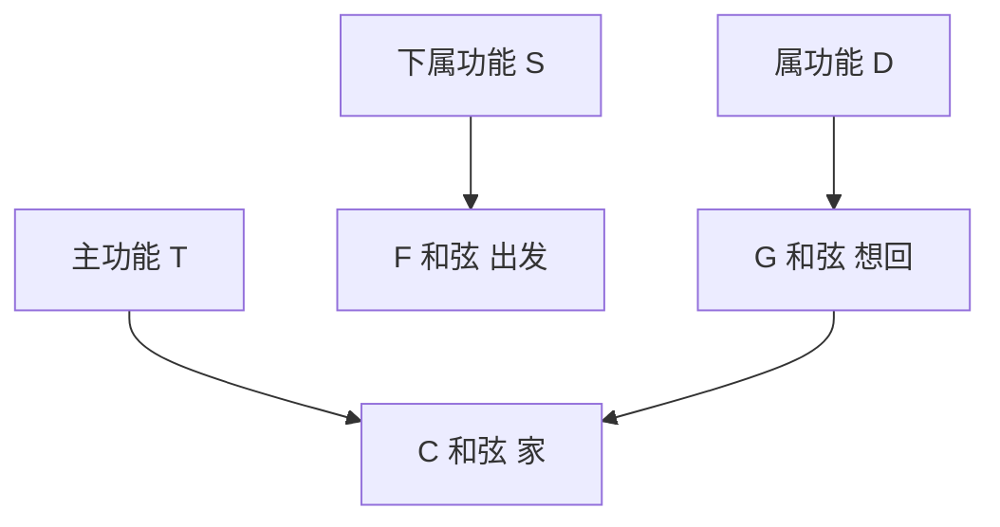

## 一、什么是和弦

和弦 = **三个或更多音同时发声**。吉他最常用的是三和弦（3 个音）。


### 1.1 三和弦的构成

以 C 大调为例：

| 成分 | 音 | 作用 |
|------|-----|------|
| 根音 | C | 和弦的"家"，决定和弦名 |
| 三音 | E | 决定大调（明亮）还是小调（忧郁） |
| 五音 | G | 增加丰满度，协和 |

### 1.2 大三和弦 vs 小三和弦

| 类型 | 公式 | 听感 | 例子 |
|------|------|------|------|
| 大三和弦 | 根音 + 大三度(4半音) + 纯五度(7半音) | 明亮 | C = C E G |
| 小三和弦 | 根音 + 小三度(3半音) + 纯五度(7半音) | 忧郁 | Am = A C E |

> **区别只在三音**：大三和弦的三音比小三和弦高一个半音。这一个半音的差别，决定了"明亮"还是"忧郁"。

---

## 二、C 大调的七个三和弦

C 大调有七个顺阶和弦（用调内音构成）：

| 级数 | 罗马数字 | 和弦 | 类型 | 听感 |
|------|---------|------|------|------|
| I | I | C | 大 | 主功能，"家" |
| II | ii | Dm | 小 | 下属方向 |
| III | iii | Em | 小 | 中介 |
| IV | IV | F | 大 | 下属，"出发" |
| V | V | G | 大 | 属，"想回家" |
| VI | vi | Am | 小 | 关系小调 |
| VII | vii° | Bdim | 减 | 紧张，少用 |

> **口诀**：大调顺阶和弦的规律是"大-小-小-大-大-小-减"。

### 功能分组



- **T（主）**：C —— 稳定、归宿
- **S（下属）**：F —— 偏离、出发
- **D（属）**：G —— 紧张、想回主

经典走向：**C → F → G → C**（家→出发→想回→回家）

---

## 三、新手必学的 8 个开放和弦

### 3.1 和弦图怎么看

```
   ╔═══╦═══╦═══╗
   ║   ║   ║   ║  ← 1品
   ╠═══╬═══╬═══╣
   ║   ║   ║   ║  ← 2品
   ╠═══╬═══╬═══╣
   ║   ║   ║   ║  ← 3品
   ╚═══╩═══╩═══╝
    1   2   3   ← 弦号（从左到右：6弦 5弦 4弦...）

○ = 空弦弹响
● = 按住这根弦
✕ = 不弹这根弦
数字 = 用哪个手指按
```

### 3.2 C 和弦（大三和弦）

```
   C 和弦
    0  1  0  2  3  0
   ╔══╦══╦══╦══╦══╦══╗
1弦║  ║  ║  ║  ║  ●║  ← 1弦1品（食指）
2弦║  ║  ║  ║ ●║  ║  ← 2弦1品... 等等

简化记法：
1弦: 0品(空)
2弦: 1品 ● (1指 食指)
3弦: 0品(空)
4弦: 2品 ● (2指 中指)
5弦: 3品 ● (3指 无名指)
6弦: 0品(空)
```

**按法：**
- 食指按 2 弦 1 品
- 中指按 4 弦 2 品
- 无名指按 5 弦 3 品

**注意**：6 弦和 1 弦是空弦，弹奏时不要碰到。

### 3.3 Am 和弦（小三和弦）

```
Am 和弦
1弦: 0品(空)
2弦: 1品 ● (食指)
3弦: 2品 ● (无名指)
4弦: 2品 ● (中指)
5弦: 0品(空)
6弦: 0品(空)
```

> **Am 与 C 的关系**：Am 只比 C 多按一个 3 弦 2 品（无名指从 5 弦移到 3 弦）。C 和 Am 共享前两个手指位置，转换非常方便。

### 3.4 Em 和弦

```
Em 和弦
1弦: 0品(空)
2弦: 0品(空)
3弦: 0品(空)
4弦: 2品 ● (中指)
5弦: 2品 ● (无名指)
6弦: 0品(空)
```

**最简单的和弦之一**，只按 2 根弦。

### 3.5 G 和弦

```
G 和弦
1弦: 3品 ● (小指)
2弦: 0品(空)
3弦: 0品(空)
4弦: 0品(空)
5弦: 2品 ● (中指)
6弦: 3品 ● (无名指)
```

**另一种按法**（更常用）：
- 中指按 6 弦 3 品
- 食指按 5 弦 2 品
- 无名指按 1 弦 3 品（不用小指）

### 3.6 D 和弦

```
D 和弦
1弦: 2品 ● (中指)
2弦: 3品 ● (无名指)
3弦: 2品 ● (食指)
4弦: 0品(空)
5弦: ✕ 不弹
6弦: ✕ 不弹
```

### 3.7 Dm 和弦

```
Dm 和弦
1弦: 1品 ● (食指)
2弦: 3品 ● (无名指)
3弦: 2品 ● (中指)
4弦: 0品(空)
5弦: ✕
6弦: ✕
```

### 3.8 E 和弦

```
E 和弦
1弦: 0品(空)
2弦: 0品(空)
3弦: 1品 ● (食指)
4弦: 2品 ● (无名指)
5弦: 2品 ● (中指)
6弦: 0品(空)
```

### 3.9 A 和弦

```
A 和弦
1弦: 0品(空)
2弦: 2品 ● (无名指)
3弦: 2品 ● (无名指或中指)
4弦: 2品 ● (中指)
5弦: 0品(空)
6弦: ✕
```

---

## 四、大横按初识：F 和弦

F 是新手的第一道坎——需要食指横按 6 根弦。

### 4.1 为什么 F 难

F 和弦要求食指同时按住 6 根弦的第 1 品，其余三指按其他音：

```
F 和弦（大横按）
1弦: 1品 ▬ (食指横按)
2弦: 1品 ▬ (食指)
3弦: 2品 ● (中指... 实际是无名指)
...
```

### 4.2 简化版 Fmaj7

新手按不响 F 时，先用 Fmaj7 过渡（少按一根弦）：

```
Fmaj7 和弦
1弦: 0品(空) ← 注意，不按！
2弦: 1品 ● (食指)
3弦: 2品 ● (中指... 实际3指)
4弦: 3品 ● (无名指... 实际4指)
5弦: ✕
6弦: ✕
```

### 4.3 大横按技巧

| 要点 | 说明 |
|------|------|
| 食指侧按 | 用食指侧面（靠近拇指那侧）按，不是正面指腹 |
| 靠近品丝 | 食指尽量靠近 1 品品丝（琴身方向） |
| 拇指下移 | 拇指从琴颈背面下移，提供更大反作用力 |
| 弯曲食指 | 食指第一关节处微微弯曲，避开中间空隙 |

> **耐心**：F 和弦通常需要 1-3 个月才能按响。每天练 5 分钟，慢慢来。

---

## 五、和弦推导原理

### 5.1 移位推导

和弦在指板上"移动"会变调。例如：

- **E 和弦**（开放）→ 全部上移 1 品 + 食指横按 1 品 = **F 和弦**
- **E 和弦** → 上移 3 品 + 横按 3 品 = **G 和弦**


### 5.2 为什么能这样推导

整个和弦形状不变，整体上移 N 品，所有音都升高 N 个半音——和弦类型不变，只是调变了。

---

## 六、本章练习

### 练习 1：单个和弦按响

按 C 和弦，从 6 弦到 1 弦依次拨响，每根弦都应清晰无杂音。如果某根弦闷了，检查是哪个手指压到了。

### 练习 2：和弦音清晰度

按 Am 和弦，用右手从 5 弦向 1 弦扫一遍，听每个音是否都响。

### 练习 3：F 简化版

先练 Fmaj7，确保 2、3、4 弦都响。然后尝试加按 1 弦 1 品（食指轻搭），看能否响。

### 练习 4：默写和弦构成

默写 C、Am、G、Em 的构成音（根音+三音+五音）。

| 和弦 | 根音 | 三音 | 五音 |
|------|------|------|------|
| C | C | E | G |
| Am | A | C | E |
| ? | ? | ? | ? |

---

## 七、常见误区与 FAQ

| 问题 | 解答 |
|------|------|
| 按和弦总碰到不该碰的弦 | 手指不够拱起，调整手腕外翻 |
| F 和弦按不响 | 正常，先练 Fmaj7，同时练食指力量 |
| 和弦按了之后手指疼 | 力度过大，找到"刚好能响"的力度 |
| 要不要背所有和弦 | 先掌握 8 个开放和弦 + F，能弹 80% 的歌 |
| 和弦名字怎么读 | C 读"C大"，Am 读"A小"，F 读"F大" |

---

## 小结

- **三和弦** = 根音 + 三音 + 五音
- **大调顺阶和弦**：大-小-小-大-大-小-减
- **8 个开放和弦**：C Am Em G D Dm E A
- **F 大横按**：先练 Fmaj7 过渡，需要 1-3 个月
- **移位推导**：和弦形状不变，整体上移 = 变调

下一章：和弦转换——让和弦连贯起来。
