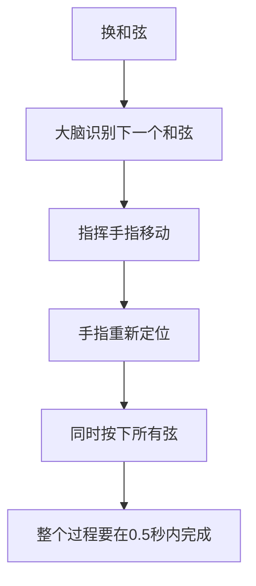

## 一、为什么换和弦难

新手弹唱最大的障碍不是按和弦，而是**从一个和弦换到另一个和弦**。原因：



这需要大脑和肌肉的深度配合，只能靠"正确练习"建立肌肉记忆。

---

## 二、转换三大原则

### 2.1 原则一：最小移动

移动的手指越少、距离越短，转换越快。

**例子：C → Am**

```
C 和弦:                Am 和弦:
  食指: 2弦1品           食指: 2弦1品  ← 不动！
  中指: 4弦2品           中指: 4弦2品  ← 不动！
  无名指: 5弦3品         无名指: 3弦2品 ← 只动这一个
```

C 和 Am 共享前两个手指，**只需移动无名指**。这就是最小移动。

### 2.2 原则二：保留指

如果两个和弦有共同按位，移动时**保留共同手指不动**，只移动不同的手指。

**例子：Am → C**

转换方法和上面一样，反向操作：

1. 食指、中指**保持不动**
2. 无名指从 3 弦 2 品移到 5 弦 3 品

### 2.3 原则三：预判形状

换和弦前，左手**在空中预先摆好下一个和弦的形状**，落到指板时已经是正确形状，而不是一根一根手指找位置。


> **这是高手和新手的最大区别**：新手一个手指一个手指地换，高手一次性整体换。

---

## 三、常见转换组合训练

### 3.1 C ↔ Am

最简单的转换，只动一个手指。

```
C → Am → C → Am ...
节奏: |C Am |C Am |
```

**要点**：食指、中指保持不动，无名指在 5 弦 3 品和 3 弦 2 品之间移动。

### 3.2 G ↔ Em

```
G 和弦:                Em 和弦:
  中指: 6弦3品           中指: 5弦2品... 
  食指: 5弦2品           无名指: 4弦2品
  无名指: 1弦3品
```

G → Em 时，所有手指都要换位置，但形状相似。

**技巧**：G 的中指在 6 弦，Em 的中指在 5 弦——保持中指和无名指"并排"的关系，整体下移一根弦 + 食指松开 + 无名指从 1 弦移到 4 弦。

### 3.3 C ↔ G

这是弹唱最常用的转换之一，但有难度：

```
C 和弦:                G 和弦:
  食指: 2弦1品           中指: 5弦2品（原食指位置附近）
  中指: 4弦2品           无名指: 6弦3品
  无名指: 5弦3品         小指/无名指: 1弦3品
```

**推荐指法转换**：
1. C 的中指（4 弦 2 品）→ 移到 5 弦 2 品（变成 G 的中指）
2. C 的无名指（5 弦 3 品）→ 移到 6 弦 3 品（变成 G 的无名指）
3. 食指松开
4. 小指按 1 弦 3 品

### 3.4 D ↔ A

```
D 和弦:                A 和弦:
  食指: 3弦2品           食指: 4弦2品... 
  中指: 1弦2品           中指: 3弦2品
  无名指: 2弦3品         无名指: 2弦2品
```

D 和 A 都是"3 个手指并排"形状，整体平移即可。

### 3.5 F 简化版（Fmaj7）↔ C

```
Fmaj7:                C:
  食指: 2弦1品           食指: 2弦1品 ← 不动
  中指: 3弦2品           中指: 4弦2品
  无名指: 4弦3品         无名指: 5弦3品
```

食指不动，中指和无名指下移。

---

## 四、练习方法

### 4.1 慢速分解（拆解练习）

不要一开始就追求速度。先用极慢速度，把每个动作做对：

1. 弹响 C 和弦
2. **停**，想 Am 的形状
3. 缓慢移动手指（注意保留指）
4. 弹响 Am 和弦
5. 检查是否每根弦都响

> **关键**：宁可慢到 5 秒换一次，也要保证动作正确、声音干净。错误动作重复 1000 次只会更难改。

### 4.2 节拍器练习

60 BPM，一拍换一次和弦：

```
| C - Am - | C - Am - |
  ↓   ↓       ↓   ↓
```

熟练后逐渐提速：60 → 70 → 80 → 100 BPM。

### 4.3 闭眼练习

闭眼练换和弦，强迫自己靠"感觉"而非"视觉"找位置。这是建立肌肉记忆最快的方法。

### 4.4 盲换练习

不看左手，只在脑子里想"现在按 C"，然后"换 Am"，检查是否按对。这个练习能快速暴露你对和弦形状的熟悉程度。

---

## 五、四个万能和弦走向

掌握以下 4 个和弦走向，能弹唱几百首流行歌：

### 5.1 卡农走向（I-V-vi-IV）

```
C → G → Am → F
```

适用：《童年》《那些年》《Let It Be》等

### 5.2 1645 走向

```
C → Am → F → G
```

适用：无数华语流行歌

### 5.3 4536251 走向

```
F → G → Em → Am → Dm → G → C
```

适用：《演员》《说散就散》等大量抒情歌

### 5.4 15634125 走向

```
C → G → Am → Em → F → C → Dm → G
```

适用：周杰伦《晴天》《七里香》等

> **练习**：每天用 60 BPM 把这些走向弹 10 遍，一周后你的转换速度会显著提升。

---

## 六、本章练习

### 练习 1：C-Am-C-Am 循环

60 BPM，每拍换一次，持续 2 分钟。注意保留指。

### 练习 2：卡农走向

```
|C |G |Am |F |
 4拍 4拍 4拍 4拍
```

每个和弦 4 拍，循环 8 遍。

### 练习 3：闭眼换和弦

闭眼，想"C"，按下，睁眼检查。再闭眼想"Am"，按下，检查。重复 G、Em、D。

### 练习 4：1-6-4-5 循环提速

```
C Am F G C Am F G ...
60 BPM → 70 → 80 → 90 → 100 BPM
```

每个速度稳定 1 分钟才提速。

---

## 七、常见误区与 FAQ

| 问题 | 原因 | 解决 |
|------|------|------|
| 换和弦总是慢半拍 | 一个手指一个手指换 | 整体换，预判形状 |
| 换完和弦总有杂音 | 手指没落准 | 慢速练，确保每根弦都响 |
| 换 F 总卡住 | 力量不够+形状不熟 | 先练 Fmaj7，同时练食指力量 |
| 看着左手才能换 | 依赖视觉 | 闭眼练习，建立肌肉记忆 |
| 越练越快但越来越乱 | 没控制节奏 | 回慢速，节拍器 |

---

## 小结

- **最小移动**：保留共同手指，只动不同的
- **预判形状**：空中摆好形状再落下
- **闭眼练习**：肌肉记忆的关键
- **4 个万能走向**：卡农、1645、4536251、15634125
- **慢即是快**：慢速正确练习 > 高速错误练习

下一章：节奏基础与扫弦——让和弦"动"起来。
