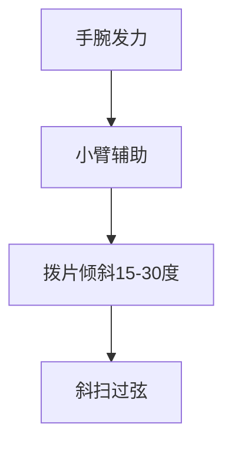

## 一、节奏的本质

节奏 = **时间的分割**。把一段时间均匀分成若干份，每份是一个"拍"。


### 1.1 BPM（每分钟拍数）

| BPM | 速度感觉 | 曲风 |
|-----|---------|------|
| 60 | 慢、抒情 | 慢歌 |
| 80 | 中速 | 民谣 |
| 100 | 偏快 | 流行 |
| 120 | 快 | 摇滚 |
| 140+ | 很快 | 朋克、金属 |

### 1.2 音符时值

| 音符 | 时值 | 在 4/4 拍中 |
|------|------|------------|
| 全音符 | 4 拍 | 一小节弹一次 |
| 二分音符 | 2 拍 | 一小节弹 2 次 |
| 四分音符 | 1 拍 | 一小节弹 4 次 |
| 八分音符 | 1/2 拍 | 一小节弹 8 次 |
| 十六分音符 | 1/4 拍 | 一小节弹 16 次 |

```
4/4 拍一小节：

四分:  | ●  ●  ●  ●  |      ← 4 个音
八分:  | ↓↑ ↓↑ ↓↑ ↓↑ |      ← 8 个音
十六分:|↓↓↑↑↓↓↑↑↓↓↑↑↓↓↑↑|    ← 16 个音
```

---

## 二、扫弦方向

### 2.1 下扫与上扫

| 符号 | 方向 | 动作 | 弦序 |
|------|------|------|------|
| ↓ | 下扫 | 从低音弦扫向高音弦 | 6→1 弦 |
| ↑ | 上扫 | 从高音弦扫向低音弦 | 1→6 弦 |

> **注意**：下扫不是从 6 弦一直扫到 1 弦，而是根据和弦需要扫的弦范围。例如 D 和弦只扫 4-1 弦。

### 2.2 扫弦动作



| 错误 | 正确 |
|------|------|
| 整个手臂画圈 | 手腕转动为主 |
| 拨片垂直插入 | 倾斜 15-30° |
| 每根弦都用大力 | 力度均匀，靠惯性 |
| 扫得太深（卡弦） | 只扫过弦表面 |

> **关键**：扫弦的发力点在**手腕**，不是手臂。想象"甩掉手上的水"那个动作。

---

## 三、力度层次

扫弦不是每次都一样响，要有强弱的"层次感"。

### 3.1 强弱标记

| 符号 | 含义 | 力度 |
|------|------|------|
| **>** 或 **f** | 强 | 大力 |
| 普通 | 中 | 中等 |
| **p** | 弱 | 轻轻扫 |
| **pp** | 极弱 | 几乎只碰到弦 |

### 3.2 重音规律

4/4 拍的重音规律：

```
| ↓ ↑ ↓ ↑ ↓ ↑ ↓ ↑ |
  ●     ●     ●      ← 重音（1、3 拍强，2、4 拍次强）
```

- 第 1 拍：最强
- 第 3 拍：次强
- 第 2、4 拍：弱
- 上扫：更弱

> **为什么这样**：这是几百年来音乐实践总结的"最自然"的重音分布，听起来有律动感。

---

## 四、5 种常用扫弦节奏型

### 4.1 节奏型 1：基础下下下下

```
| ↓  ↓  ↓  ↓ |
  1  2  3  4
```

最简单，适合极慢的歌或练习。每拍一下下扫。

### 4.2 节奏型 2：下下上上（八分音符）

```
| ↓ ↓ ↑ ↑ ↓ ↓ ↑ ↑ |
  1 & 2 & 3 & 4 &
```

每拍两下（一下一上），最常用的扫弦型之一。

### 4.3 节奏型 3：下下上 上下上（万能扫弦）

```
| ↓ ↓ ↑ ↑ ↓ ↑ |
  1 & 2 & 3 e & a
```

更详细写法：

```
| ↓ ↓ ↑ ↑ ↓ ↑ |
 1  2 & 3 & 4 &    ← 经典扫弦
```

这是**华语流行歌最常用的扫弦**，能套 80% 的歌。

### 4.4 节奏型 4：切分扫弦

```
| ↓ ↑ ↑ ↓ ↑ |
  1 & 2 & 3 & 4 &
```

第 2 拍不下扫，制造切分感，听起来更"摇摆"。

### 4.5 节奏型 5：民谣扫弦

```
| ↓ ↓ ↑ ↑ ↑ ↓ ↑ |
  1  2 & 3 & 4 &
```

注意第 3 拍的两个上扫连续，营造民谣的轻快感。

---

## 五、闷音（Palm Mute）入门

### 5.1 什么是闷音

右手手掌轻搭在琴桥上，让弦的振动被部分抑制，产生"闷闷的"音色。

```
正常:    咚—————（有余韵）
闷音:    咚!（短促、有力）
```

### 5.2 动作要领

1. 右手手掌的**侧面**（小指下方那块肉）
2. 轻搭在**琴桥上**（不是弦上）
3. 拨弦时，弦能振动但被手掌抑制

| 错误 | 正确 |
|------|------|
| 手掌压在弦上 | 手掌搭在琴桥上 |
| 完全闷死没声音 | 闷住一部分，保留音高 |
| 太靠前（指板方向） | 靠近琴桥 |

### 5.3 应用场景

- **节奏吉他**：制造紧凑的低音律动
- **副歌前**：主歌闷音，副歌放开，形成对比
- **金属/摇滚**：下拨连续闷音

---

## 六、本章练习

### 练习 1：节拍器踩拍

不开吉他，跟着节拍器**拍手**或**跺脚**，60 BPM、80 BPM、100 BPM 各 1 分钟。先建立稳定的节奏感。

### 练习 2：空弦下扫

左手不按和弦，右手用拨片在 5-1 弦范围下扫，跟节拍器：

```
60 BPM:
| ↓ - - - | ↓ - - - |  （每拍一下）
| ↓ ↓ ↓ ↓ | ↓ ↓ ↓ ↓ |  （每拍两下，八分音符）
```

### 练习 3：节奏型 3（万能扫弦）

用 C 和弦，60 BPM：

```
| ↓ ↓ ↑ ↑ ↓ ↑ |  循环 8 遍
  1 2 & 3 & 4 &
```

要求：上下扫力度均匀，节奏稳定。

### 练习 4：闷音对比

同一和弦，先正常扫 4 拍，再闷音扫 4 拍，对比音色：

```
| C C C C | C(mute) C(mute) C(mute) C(mute) |
```

### 练习 5：换和弦+扫弦

```
|C C C C |G G G G |Am Am Am Am |F F F F |
 万能扫弦型，60→80 BPM
```

---

## 七、常见误区与 FAQ

| 问题 | 原因 | 解决 |
|------|------|------|
| 扫弦声音乱 | 扫过太多弦 | 控制扫弦范围（如 D 和弦只扫 4-1 弦） |
| 上扫声音小 | 拨片角度不对 | 上扫时拨片更倾斜些 |
| 节奏不稳 | 没用节拍器 | 必须用节拍器练 |
| 扫弦卡弦 | 拨片插入太深 | 减少露出长度，只擦过弦表面 |
| 闷音没声音 | 手掌位置太靠前 | 手掌往琴桥方向移 |

---

## 小结

- **音符时值**：四分=1拍，八分=半拍，十六分=1/4拍
- **扫弦发力**：手腕为主，拨片倾斜
- **重音**：1、3 拍强，2、4 拍弱
- **万能扫弦**：↓ ↓ ↑ ↑ ↓ ↑
- **闷音**：手掌搭琴桥，部分抑制振动

下一章深入节奏层次——让伴奏更有动态。
