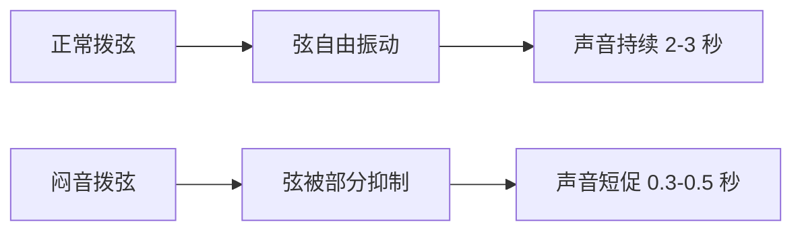
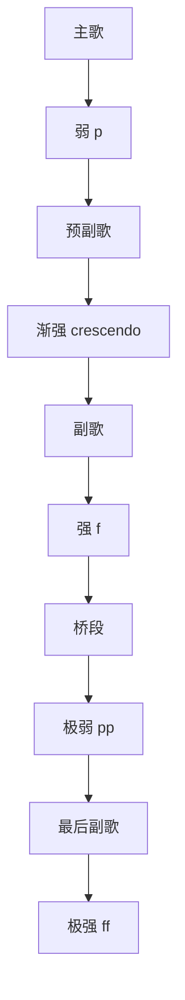

## 一、闷音的深入原理

### 1.1 为什么闷音听起来"有劲"

正常拨弦时，弦自由振动，声音有余韵（sustain）。闷音时，手掌接触弦的根部，抑制了部分振动：



- 短促 → 节奏感强 → 听起来"紧、有力"
- 持续 → 旋律感强 → 听起来"抒情、绵延"

### 1.2 闷音的"度"

闷音不是开关，而是连续可调的：

| 手掌压力 | 效果 | 应用 |
|---------|------|------|
| 几乎不碰 | 正常音 | 旋律、抒情 |
| 轻搭 | 轻微抑制，音色收紧 | 流行伴奏 |
| 中等压力 | 明显闷音，短促有力 | 节奏吉他 |
| 重压 | 几乎成"噗噗"声 | 金属、重摇滚 |

---

## 二、强弱对比（动态）

### 2.1 什么是动态

同一首歌里，**有强有弱**才有起伏。从头到尾一个力度弹奏，听起来平淡。



### 2.2 强弱标记

| 标记 | 名称 | 力度 |
|------|------|------|
| **pp** | 极弱 | 几乎只碰到弦 |
| **p** | 弱 | 轻扫 |
| **mp** | 中弱 | 中等偏轻 |
| **mf** | 中强 | 中等偏重 |
| **f** | 强 | 大力扫 |
| **ff** | 极强 | 全力扫 |
| **cresc.** | 渐强 | 越来越响 |
| **dim.** | 渐弱 | 越来越轻 |

### 2.3 力度怎么控制

| 力度 | 控制方法 |
|------|---------|
| 弱 | 拨片更倾斜，减少扫弦深度，手腕放松 |
| 中 | 正常扫弦 |
| 强 | 拨片接近垂直，加大扫弦深度，手腕发力 |
| 极强 | 手臂参与，扫过更多弦 |

> **关键**：强不是"砸"，而是"饱满"。用整个手臂"甩"出来，而不是用蛮力戳。

---

## 三、节奏型变体

### 3.1 在基础型上加减

**基础型**：↓ ↓ ↑ ↑ ↓ ↑

**变体 1：加闷音**
```
| ↓m ↓ ↑ ↑ ↓ ↑ |   ← 第1拍闷音，其余正常
```
m = mute

**变体 2：空拍**
```
| ↓ - ↑ ↑ ↓ ↑ |   ← 第2拍不下扫，留空
```
"-" = 不扫，但手要动（保持节奏感）

**变体 3：重音转移**
```
| ↓ ↓ ↑ ↑ ↓ ↑ |   ← 常规重音（1、3拍）
| ↓ ↓ ↑ ↑ ↓ ↑ |   ← 把重音放到第2、4拍，产生切分感
```

### 3.2 切分节奏

切分 = **重音不在常规位置**，产生"摇摆"感。

```
常规:    | ↓ ↓ ↓ ↓ |  重音在1、3
切分:    | ↓ ↑ ↓ ↑ |  重音在1、&3&（反拍）
```

**经典切分扫弦**：
```
| ↓ ↑ - ↓ ↑ - |  ← 第2、4拍后半不扫
  1 & 2 & 3 & 4 &
```

### 3.3 三连音

把一拍分成三等份：

```
| ↓ ↑ ↓ ↑ ↓ ↑ |  ← 每拍3个音
  1 tl 2 tl 3 tl 4 tl
```

用于蓝调、爵士、Shuffle 节奏。

---

## 四、低音弦+高音弦分层

### 4.1 拆分扫弦

不是每次都扫所有弦，而是**有选择地扫低音或高音弦**：

```
| ↓低 ↑高 ↓低 ↑高 |   ← 交替扫低音弦和高音弦
```

- ↓低 = 只扫 6-4 弦（低音）
- ↑高 = 只扫 3-1 弦（高音）

### 4.2 低音先行

```
| ↓低 - ↓ ↓ ↑ |   ← 第1拍只扫低音弦（像贝斯）
  1   2 & 3 & 4 &
```

这种"低音先行"的扫法是民谣吉他的标志性声音，听起来像有贝斯在跟。

### 4.3 低音 walk

低音弦弹一个简单的旋律线：

```
| C和弦: ↓低6弦 - ↓低5弦 - |   ← 低音从6弦走到5弦
```

C 和弦时：6 弦空弦（E，C 的三音）→ 5 弦 3 品（C，根音）

---

## 五、闷音节奏型实战

### 5.1 流行闷音型

```
| ↓m ↓m ↑m ↓m ↑m |   ← 全闷音，八分音符
  1 & 2 & 3 & 4 &
```

适合主歌铺垫。

### 5.2 主歌→副歌的对比

```
主歌: | ↓m ↓m ↑m ↓m ↑m | 闷音，弱
预副: | ↓m ↓ ↑ ↓ ↑ |     渐强，部分闷音
副歌: | ↓ ↓ ↑ ↑ ↓ ↑ |    开放，强
```


### 5.3 卡尔·帕金斯型（乡村/摇滚）

```
| ↓m ↑ ↓ ↑m ↓ ↑ |   ← 闷音和开放交替
  1 & 2 & 3 & 4 &
```

闷音在低音弦，开放在高音弦——这就是摇滚的经典声音。

---

## 六、本章练习

### 练习 1：力度控制

用 C 和弦，同一节奏型（万能扫弦），分别用 p、mp、mf、f 四种力度各弹 4 小节，感受动态变化。

### 练习 2：闷音开关

```
| C(mute) 4拍 | C(open) 4拍 |  循环
```

闷音 4 拍，开放 4 拍，反复切换。训练手掌的快速开关。

### 练习 3：低音+高音分层

```
| ↓低 ↑高 ↓低 ↑高 |  循环
```

只扫低音弦（6-4）和只扫高音弦（3-1）交替。

### 练习 4：主副歌对比

```
| Am(mute) 闷音弱 4拍 | C(open) 开放强 4拍 |
```

模拟歌曲的主副歌对比。

### 练习 5：三连音

60 BPM，每拍 3 个音，下上下：

```
| ↓ ↑ ↓ ↑ ↓ ↓ ↑ ↓ ↑ ↓ ↑ ↓ |
  1 tl 2 tl 3 tl 4 tl
```

---

## 七、常见误区与 FAQ

| 问题 | 原因 | 解决 |
|------|------|------|
| 闷音不均匀 | 手掌位置不稳 | 固定手掌位置，只动手腕 |
| 强扫弦时打品 | 力度过大 | 用手腕发力，不是砸 |
| 节奏型听起来平淡 | 力度单一 | 加入强弱对比 |
| 低音高音分层不清 | 扫弦范围不准 | 刻意控制扫到哪几根弦 |
| 切分听起来像错了 | 重音不在拍上 | 节拍器开八分音符模式 |

---

## 小结

- **闷音是连续可调**：从轻微抑制到完全闷死
- **动态是起伏**：强-弱-强-弱才有律动
- **分层扫弦**：低音弦和高音弦分开扫，像贝斯+吉他
- **主副歌对比**：闷音弱→开放强，制造爆发感
- **切分**：重音不在常规位置，产生摇摆

下一章：指弹入门——让一只手同时弹旋律和伴奏。
