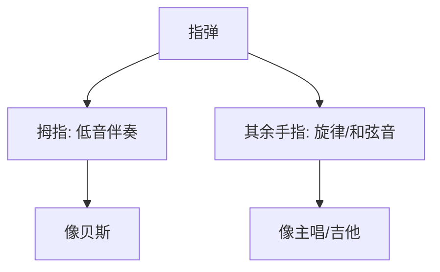
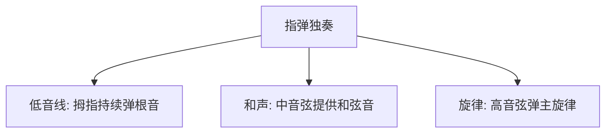

## 一、指弹 vs 扫弦

扫弦是"伴奏"，指弹是"自己同时弹旋律和伴奏"——一个人像一个乐队。



| | 扫弦 | 指弹 |
|---|---|---|
| 同时发声 | 6 根弦一起 | 选择性拨响 |
| 功能 | 纯伴奏 | 旋律+伴奏 |
| 难度 | 低 | 中-高 |
| 适用 | 弹唱 | 独奏、伴奏 |

---

## 二、分解和弦（Arpeggio）

### 2.1 什么是分解和弦

把和弦的音**依次拨响**，而不是同时扫。

```
扫弦:  ↓ (CEG同时响)
分解:  C → E → G → C (依次响)
```

### 2.2 常用分解型（53231323）

新手必练的分解型，数字是弦号：

```
5 3 2 3 1 3 2 3
↑ ↑ ↑ ↑ ↑ ↑ ↑ ↑
拨 拨 拨 拨 拨 拨 拨 拨
```

| 数字 | 弦 | 手指 |
|------|-----|------|
| 5 | 5 弦（低音） | p |
| 3 | 3 弦 | i |
| 2 | 2 弦 | m |
| 1 | 1 弦 | a |

> **指法**：5 弦用拇指 p，3 弦用食指 i，2 弦用中指 m，1 弦用无名指 a。但也有用 i-m-i-m 交替的，根据个人习惯。

### 2.3 不同和弦的分解

按 C 和弦时，5 弦 3 品是根音 C，所以从 5 弦开始。按 Am 时，5 弦空弦是 A（根音），也从 5 弦开始。

| 和弦 | 根音弦 | 分解型 |
|------|--------|--------|
| C | 5 弦 | 5 3 2 3 1 3 2 3 |
| Am | 5 弦 | 5 3 2 3 1 3 2 3 |
| G | 6 弦 | 6 3 2 3 1 3 2 3 |
| Em | 6 弦 | 6 3 2 3 1 3 2 3 |
| D | 4 弦 | 4 3 2 3 1 3 2 3 |
| A | 5 弦 | 5 3 2 3 1 3 2 3 |

> **规律**：先弹根音弦（拇指），再弹 3、2、1、2、3 高音弦。

---

## 三、Travis Picking（乡村指弹）

### 3.1 什么是 Travis Picking

以乡村吉他手 Merle Travis 命名的指弹风格：**拇指弹稳定的低音，其余手指弹旋律或和弦音**。

```
| ↓低 - ↑高 - ↑高 - |
  p   i m   i m
  1   2 & 3   4 &
```

拇指每拍弹一次低音（像贝斯），食指中指在高音弦上弹切分音。

### 3.2 基础型

```
| ↓低 ↑高 ↑低 ↑高 |
  p   i m   i m
  1 & 2 & 3 & 4 &
```

- 第 1 拍：拇指弹低音弦
- 第 1 拍后半：食指、中指同时弹高音弦
- 第 2 拍：拇指弹另一个低音
- 第 2 拍后半：食指、中指再弹高音弦

### 3.3 实战：C → G 的 Travis

```
C 和弦:
| 5弦 - 3弦+2弦 - 4弦 - 3弦+2弦 |
  p       i m       p       i m

G 和弦:
| 6弦 - 3弦+2弦 - 4弦 - 3弦+2弦 |
  p       i m       p       i m
```

---

## 四、旋律 + 伴奏

### 4.1 基本思路

指弹独奏时，一首曲子通常由三部分组成：



### 4.2 旋律在最高音

人耳对高音最敏感，所以**旋律通常放在第 1 弦（最高音）**，由 a 指（无名指）弹奏。

```
旋律:   ---------E---------F---------G--------- （1弦）
和声:   -----C---------E---------G--------- （3弦）
低音:   C-----------------G----------------- （5弦）
```

### 4.3 卡农片段示例

简化版卡农进行，旋律在高音弦：

```
| C: 5弦0品 - 3弦0品 - 2弦1品 - 1弦0品 |
  p(低音)  i(和声)  m(和声)  a(旋律)
```

> **要点**：低音要弹得稍重（稳住节奏），旋律音要弹得清晰（突出）。

---

## 五、和声的简化

### 5.1 只弹需要的音

不需要每根弦都弹，根据需要选择：

```
完整 C 和弦: C E G C E（5根弦）
简化指弹:    C - - G E（只弹3根：根音+五音+三音）
```

### 5.2 低音行走（Bass Walk）

低音不只是根音，可以"走"出一条旋律线：

```
C 和弦:  5弦3品(C) → 5弦0品(A) → 6弦空弦(E)... 
         根音       五音的低八度  三音
```

这种低音行走让伴奏更有"流动感"。

---

## 六、本章练习

### 练习 1：53231323 基础

按 C 和弦，用分解型 5-3-2-3-1-3-2-3，60 BPM，每音一拍。然后换 Am、G、Em、D，循环。

### 练习 2：换和弦 + 分解

```
| C 53231323 | G 63231323 | Am 53231323 | F 43231323 |
```

每个和弦用对应的根音弦开始。

### 练习 3：Travis Picking

60 BPM：
```
| C: 5 - 21 - 4 - 21 |  循环
  p    im   p    im
```
21 = 2 弦和 3 弦同时拨（i 弹 3 弦，m 弹 2 弦）。

### 练习 4：旋律突出

弹 C 大调音阶时，拇指轻弹低音 C（5 弦 3 品），a 指弹旋律。确保旋律音比低音响。

### 练习 5：闭眼听

闭眼弹分解和弦，专注听每个音是否清晰、力度是否均匀。

---

## 七、常见误区与 FAQ

| 问题 | 原因 | 解决 |
|------|------|------|
| 分解和弦音色发飘 | 拨弦方向不对 | 用靠弦法，拨完停在下一弦 |
| 拇指和手指打架 | 节奏不对齐 | 慢速，对节拍器 |
| 旋律音不突出 | 所有音一样响 | 旋律音稍用力，低音轻些 |
| 换和弦时分解断 | 换和弦慢 | 回第 7 章练换和弦 |
| 同时拨多根弦不齐 | 手指力度不均 | 单独练 i-m-a 三指力度 |

---

## 小结

- **分解和弦**：依次拨响和弦音
- **基础型**：53231323（根音 → 高音弦交替）
- **Travis Picking**：拇指稳定低音 + 其余手指切分高音
- **旋律+伴奏**：旋律在最高音弦，低音在最低音弦
- **靠弦法**：拨完停在下一弦，音色饱满

下一章：常用技巧——滑音、击弦、勾弦。
