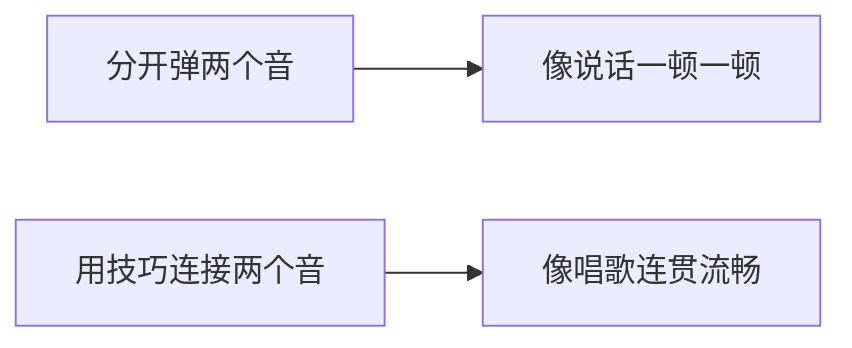
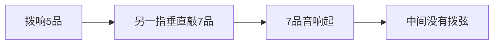

## 一、为什么要学这些技巧

光弹"音准的音"听起来像机器人。技巧让音符之间有"过渡"，更接近人声的连贯。



| 技巧 | 效果 | 符号 |
|------|------|------|
| 滑音 | 平滑过渡 | / 或 \ 或 s |
| 击弦 | 不拨弦直接按出音 | h |
| 勾弦 | 不拨弦勾出音 | p |

---

## 二、滑音（Slide）

### 2.1 原理

按住一个音弹响，**手指不离开指板**，滑动到另一个品格。


### 2.2 上滑与下滑

| 类型 | 记号 | 动作 |
|------|------|------|
| 上滑 | 5/7 | 5 品 → 7 品 |
| 下滑 | 7\5 | 7 品 → 5 品 |

### 2.3 动作要领

1. 按住起始音（如 5 品），拨响
2. **手指保持按弦压力**，沿弦滑动
3. 到达目标音（如 7 品）时，**手指停稳**
4. 滑动过程中，第一个音的余韵持续到第二个音

| 错误 | 正确 |
|------|------|
| 滑动时手指松开 | 保持压力 |
| 滑得太快或太慢 | 平稳匀速 |
| 到目标音没停稳 | 精准停在品格上 |

### 2.4 无头滑音 / 无尾滑音

| 类型 | 记号 | 说明 |
|------|------|------|
| 无头滑音 | /5 | 从不确定的位置滑到 5 品（"咻"地滑入） |
| 无尾滑音 | 5/ | 从 5 品滑到不确定位置（淡出） |

> **应用**：无头滑音常用于乐句开头，制造"进入"的感觉。

---

## 三、击弦（Hammer-On）

### 3.1 原理

弹响一个音后，**不拨弦**，用另一手指**垂直敲击**更高的品格，靠敲击的力量让弦发声。



### 3.2 记号与读法

```
5h7  ← 5 品拨响，击弦到 7 品
```

读作："五击七"。

### 3.3 动作要领

1. 食指按住 5 品，拨响
2. 无名指（或中指）**从空中垂直下落**，敲击 7 品
3. 敲击点在**指尖中央偏下**，靠近品丝
4. 敲下后**保持按住**，不要弹起

| 错误 | 正确 |
|------|------|
| 用手指"推"上去 | 垂直"砸"下去 |
| 力度太小，音不响 | 用足够力度，像敲门 |
| 敲在指腹 | 敲在指尖 |
| 敲完手指松开 | 保持按住 |

> **关键**：击弦的声音来自手指敲击琴弦的动能，所以**力度和速度**决定音量。轻轻按是按不响的。

---

## 四、勾弦（Pull-Off）

### 4.1 原理

与击弦相反：按住两个音，拨响高音后，**高音手指向下勾动**弦，让低音响起。


### 4.2 记号与读法

```
7p5  ← 7 品拨响，勾弦到 5 品
```

读作："七勾五"。

### 4.3 动作要领

1. 食指按 5 品，无名指按 7 品
2. 拨响 7 品
3. **无名指向下、向外勾动**琴弦（不是直接抬起）
4. 5 品音响起

| 错误 | 正确 |
|------|------|
| 手指直接抬起 | 向下勾动弦 |
| 勾得太轻 | 用一定力度勾 |
| 手指飞太远 | 勾完即停，回到待命位置 |

> **关键**：勾弦不是"松开"，而是"勾动"。像弹脑门那样把弦勾一下。

---

## 五、连击（连音线）

### 5.1 击勾连击

```
5h7p5  ← 拨5 → 击7 → 勾5
```

一个完整的"上下来回"。

### 5.2 应用：颤音（Trill）

快速交替击勾：

```
5h7p5h7p5h7p5...  ← 快速重复，产生颤动效果
```

用于乐句结尾的装饰。

---

## 六、装饰音

### 6.1 什么是装饰音

在主音前后加一个快速的"碎音"，让旋律更生动。

### 6.2 常见装饰音

| 类型 | 记号 | 动作 |
|------|------|------|
| 倚音 | g~5 | 快速滑到 5 品 |
| 击弦装饰 | 0h5 | 击弦快速进入 |
| 勾弦装饰 | 5p0 | 勾弦快速离开 |

### 6.3 应用示例

```
旋律: 1弦 0 0 0 3 0
装饰: 0h1p0 0 3 0  ← 第1个音加击勾装饰
```

---

## 七、本章练习

### 练习 1：滑音

第 2 弦上：5/7、7/9、9/12，每个滑音 4 拍。注意保持压力。

### 练习 2：击弦

```
1弦: 5h7 5h7 5h7 5h7
```

每个击弦音清晰、有力。

### 练习 3：勾弦

```
1弦: 7p5 7p5 7p5 7p5
```

勾出的音和拨响的音一样清晰。

### 练习 4：连击

```
1弦: 5h7p5 5h7p5  循环
```

速度逐渐加快。

### 练习 5：颤音

第 1 弦 5h7p5h7p5h7p5... 持续 10 秒。

### 练习 6：装饰音

弹《小星星》开头，每个音加击勾装饰：

```
1 1 5 5 6 6 5
↓ ↓ ↓h6p5 ↓ ↓h7p6 ↓
```

---

## 八、常见误区与 FAQ

| 问题 | 原因 | 解决 |
|------|------|------|
| 击弦音不响 | 力度不够 | 加大敲击力度，像敲门 |
| 勾弦音不响 | 没勾只松 | 向下勾动弦 |
| 滑音中途断 | 压力松了 | 全程保持压力 |
| 击勾速度上不去 | 手指抬太高 | 减小抬起高度，贴近弦 |
| 装饰音太抢戏 | 装饰音太响 | 装饰音要轻、快 |

---

## 小结

- **滑音**：贴弦滑动，保持压力
- **击弦**：垂直砸下，力度要够
- **勾弦**：向下勾动，不是松开
- **连击**：5h7p5 是基础连音
- **装饰音**：轻、快、不抢主音

下一章：进阶和弦——七和弦、挂留和弦。
