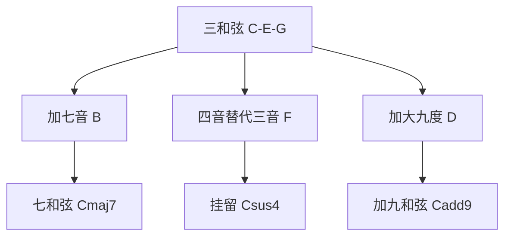

## 一、为什么需要进阶和弦

三和弦（C、Am、G）听久了会"腻"。进阶和弦在三和弦基础上加音，制造色彩变化：



---

## 二、七和弦

### 2.1 构成

在三和弦基础上加一个"七音"（根音上方七度）：

| 和弦 | 构成 | 色彩 |
|------|------|------|
| Cmaj7 | C E G B | 梦幻、爵士 |
| C7（属七） | C E G Bb | 蓝调、紧张 |
| Cm7 | C Eb G Bb | 忧郁、爵士 |
| Cm7b5 | C Eb Gb Bb | 紧张、半减 |

> **大七 vs 属七**：Cmaj7 加的是大七度 B（距根音 11 半音），C7 加的是小七度 Bb（距根音 10 半音）。差一个半音，色彩完全不同。

### 2.2 开放指法

#### Cmaj7

```
1弦: 0品(空)
2弦: 0品(空)
3弦: 0品(空)
4弦: 2品 ● (中指)
5弦: 3品 ● (无名指)
6弦: ✕
```

> **Cmaj7 只比 C 多放开 2 弦**——C 的 2 弦 1 品松开，就是 Cmaj7。

#### Am7

```
1弦: 0品(空)
2弦: 1品 ● (食指)
3弦: 0品(空)
4弦: 2品 ● (中指)
5弦: 0品(空)
6弦: 0品(空)
```

> **Am7 只比 Am 少按 3 弦**——Am 的 3 弦 2 品松开，就是 Am7。

#### G7

```
1弦: 1品 ● (食指)
2弦: 0品(空)
3弦: 0品(空)
4弦: 0品(空)
5弦: 2品 ● (中指)
6弦: 3品 ● (无名指)
```

> **G7 只比 G 多按 1 弦 1 品**。

### 2.3 七和弦的色彩应用

| 和弦 | 色彩 | 经典场景 |
|------|------|---------|
| maj7 | 梦幻、温柔 | 爵士、抒情 |
| 7 | 紧张、想解决 | 蓝调结尾、属功能 |
| m7 | 忧郁、柔 | R&B、爵士小调 |
| m7b5 | 诡异 | 小调 ii-V-i |

**经典 ii-V-I**：
```
Dm7 → G7 → Cmaj7
ii   V    I
```

爵士最经典的进行。

---

## 三、挂留和弦（Sus）

### 3.1 构成

把三和弦的三音替换为四音（sus4）或二音（sus2）：

| 和弦 | 构成 | 说明 |
|------|------|------|
| Csus4 | C F G | 三音 E → 四音 F |
| Csus2 | C D G | 三音 E → 二音 D |

> **sus = suspended（悬挂）**，三音被"悬挂"掉了，听起来"未完成、悬而未决"。

### 3.2 开放指法

#### Csus4

```
1弦: 1品 ● (食指)
2弦: 1品 ● (食指) ← 横按部分
3弦: 0品(空)
4弦: 2品 ● (中指)
5弦: 3品 ● (无名指)
6弦: 0品(空)
```

> **Csus4 只比 C 多按 1 弦 1 品**。

#### Dsus4

```
1弦: 3品 ● (无名指)
2弦: 3品 ● (小指)
3弦: 2品 ● (中指)
4弦: 0品(空)
5弦: ✕
6弦: ✕
```

#### Dsus2

```
1弦: 0品(空)
2弦: 0品(空)
3弦: 2品 ● (食指)
4弦: 0品(空)
5弦: ✕
6弦: ✕
```

### 3.3 应用：sus → 三和弦解决

挂留和弦"悬而未决"，回到三和弦时有"解决"感：

```
| Csus4 - C - | Csus4 - C - |
  悬而未决  解决
```

> **经典应用**：The Who 的《Pinball Wizard》全程用 sus4 进行。

---

## 四、加九和弦（add9）

### 4.1 构成

在三和弦基础上加一个"九音"（根音上方九度，即大调二度的高八度）：

| 和弦 | 构成 | 色彩 |
|------|------|------|
| Cadd9 | C E G D | 空灵、开阔 |

> **add9 vs sus2**：add9 保留三音（E），sus2 替换三音。add9 更"满"，sus2 更"空"。

### 4.2 开放指法

#### Cadd9

```
1弦: 0品(空)
2弦: 0品(空)  ← 松开，让 D 音响
3弦: 0品(空)
4弦: 2品 ● (中指)
5弦: 3品 ● (无名指)
6弦: 0品(空)
```

> **Cadd9 只比 C 松开 2 弦**——2 弦空弦是 B，松开后是 B... 等等，2 弦空弦是 B 不是 D。

实际上 Cadd9 需要按 2 弦 3 品（D），常用简化版：

```
Cadd9 简化:
1弦: 0品(空)
2弦: 3品 ● (无名指或小指)
3弦: 0品(空)
4弦: 2品 ● (中指)
5弦: 3品 ● (无名指)
6弦: 0品(空)
```

> **听起来像**：The Police《Every Breath You Take》的开头。

#### Dadd9

```
1弦: 0品(空)  ← 2弦是 D 的九度...
```

实际 Dadd9 按法略复杂，新手先用 Cadd9。

---

## 五、色彩和弦的实战应用

### 5.1 替换三和弦

把进行中的三和弦替换为对应色彩和弦，瞬间"高级"：

```
原版:  C  -  G  -  Am  -  F
升级:  Cadd9 - G - Am7 - Fmaj7
```

### 5.2 经典色彩进行

```
| Cadd9 - G - Am7 - Fmaj7 | 循环
```

这是华语抒情歌最爱的"清新"进行。

### 5.3 sus 的张弛

```
| Dsus4 - D - Dsus4 - D | 循环
  悬 → 解 → 悬 → 解
```

营造摇摆感。

---

## 六、本章练习

### 练习 1：七和弦按响

按 Cmaj7、Am7、G7，每和弦拨响所有弦，检查清晰度。

### 练习 2：sus → 三和弦解决

```
| Csus4 - C - | Csus4 - C - |
  悬           解决
```

听"悬而未决 → 解决"的色彩变化。

### 练习 3：色彩进行

```
| Cadd9 - G - Am7 - Fmaj7 | 循环
```

对比纯三和弦版本和色彩版本，感受差异。

### 练习 4：ii-V-I

```
| Dm7 - G7 - Cmaj7 | 循环
  ii    V    I
```

爵士经典进行。

---

## 七、常见误区与 FAQ

| 问题 | 解答 |
|------|------|
| maj7 和 7 有什么区别 | maj7 加大七度（自然音阶的 7 音），7 加小七度（降半音） |
| sus4 和 add4 区别 | sus4 替换三音，add4 保留三音（少用） |
| add9 和 9 区别 | add9 是三和弦+九音，9 是七和弦+九音（更复杂） |
| 这些和弦一定要全背吗 | 先掌握 maj7、m7、7、sus4、add9 五种就够用 |
| 听不出色彩怎么办 | 弹 C 然后 Cmaj7，对比，多听就有感觉 |

---

## 小结

- **七和弦**：三和弦 + 七音，色彩更丰富
  - maj7：梦幻
  - 7：紧张
  - m7：忧郁
- **挂留**：替换三音，悬而未决
  - sus4：替换为四音
  - sus2：替换为二音
- **加九**：三和弦 + 九音，空灵
- **应用**：替换三和弦，瞬间"高级"

下一章：调式转换与变调夹。
