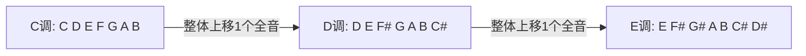
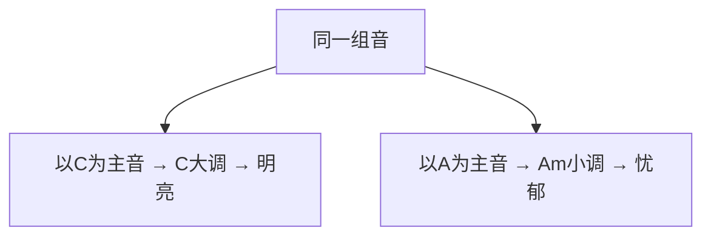

## 一、什么是调

### 1.1 调的定义

"调"是一首歌的"音高基准"。同一首歌用 C 调弹，所有音都以 C 为基准；用 D 调弹，所有音整体升高一个全音。



> **关键**：调不同，"旋律形状"相同，只是整体音高变了。像电梯：同一首歌在 1 楼（C 调）和 2 楼（D 调）听起来"一样"，只是高了。

### 1.2 为什么要换调

| 原因 | 例子 |
|------|------|
| 嗓音音域不匹配 | 原曲 D 调太高，降到 C 调唱得舒服 |
| 吉他指法太难 | 原曲 bB 调全是大横按，用 Capo 简化 |
| 男女对唱 | 男声 G 调，女声 C 调 |

---

## 二、大调与小调

### 2.1 关系小调

每个大调都有一个"关系小调"，共享同样的音，只是起点不同：

| 大调 | 关系小调 | 共享音 |
|------|---------|--------|
| C 大调 | A 小调 | C D E F G A B |
| G 大调 | E 小调 | G A B C D E F# |
| D 大调 | B 小调 | D E F# G A B C# |

> **规律**：大调的第六级音 = 关系小调的根音。C 大调第 6 级是 A，所以关系小调是 Am。

### 2.2 大调 vs 小调的色彩



- **大调**：以大调音阶的 1 级为主音，明亮
- **小调**：以大调音阶的 6 级为主音，忧郁

> **本质**：C 大调和 A 小调用的是**完全相同的 7 个音**，只是"重心"（主音）不同。

### 2.3 怎么判断一首歌是大调还是小调

| 特征 | 大调 | 小调 |
|------|------|------|
| 结尾和弦 | 多数结束在 C（主和弦） | 多数结束在 Am |
| 整体色彩 | 明亮、积极 | 忧郁、深沉 |
| 旋律走向 | 偏向 C、F、G | 偏向 Am、Dm、Em |

> **快速判断**：弹一遍歌，最后那个"回家"的和弦是 C → C 大调；是 Am → A 小调。

---

## 三、变调夹（Capo）

### 3.1 Capo 的作用

Capo 夹在指板上某品，相当于把**琴枕整体上移**。夹第 2 品，所有空弦音升高一个全音（C→D）。


### 3.2 Capo 使用场景

| 场景 | 做法 |
|------|------|
| 原曲 D 调，我只会 C 调指法 | Capo 夹 2 品，用 C 调指法弹 |
| 原曲 bB 调，全是横按 | Capo 夹 3 品，用 G 调指法弹 |
| 男声 G 调，女声要 C 调 | 女声 Capo 夹 5 品，用 G 调指法 |

### 3.3 Capo 对照表

| 原调 | 指法调 | Capo 位置 |
|------|--------|----------|
| C | C | 0 品（不夹） |
| D | C | 2 品 |
| E | C | 4 品 |
| F | C | 5 品 |
| G | C | 7 品 |
| A | C | 9 品 |
| D | G | 2 品（也可用 G 调指法） |
| E | D | 2 品 |

> **规律**：Capo 品位 = 原调 - 指法调的半音数。例如 C→D 是 2 个半音，Capo 夹 2 品。

### 3.4 Capo 使用要点

| 要点 | 说明 |
|------|------|
| 夹在品格中间 | 靠近品丝但不要压在品丝上 |
| 夹紧 | 不紧会导致音偏高、打品 |
| 调音复查 | 夹上后弦张力变化，需要重新调音 |
| 不要夹太高 | 超过 7 品品格间距太小，难按 |

---

## 四、不使用 Capo 的调式转换

### 4.1 直接换和弦

学会各调的和弦，不用 Capo 也能转调：

| 调 | I | IV | V | vi | ii |
|----|---|----|---|----|----|
| C | C | F | G | Am | Dm |
| G | G | C | D | Em | Am |
| D | D | G | A | Bm | Em |
| A | A | D | E | F#m | Bm |
| E | E | A | B | C#m | F#m |

> **规律**：每升高一个全音，所有和弦"整体上移"。C→D 时，C→D、F→G、G→A、Am→Bm、Dm→Em。

### 4.2 何时用 Capo，何时直接换

| 情况 | 选择 |
|------|------|
| 只会开放和弦，原调需要横按 | 用 Capo |
| 熟练各调和弦，原调和指法调接近 | 直接换 |
| 想要 Capo 夹出的"明亮"音色 | 用 Capo |
| 需要弹旋律独奏 | 不用 Capo（影响音域） |

---

## 五、分析歌曲调式

### 5.1 步骤

1. **找最后一个和弦**：歌的结尾通常是主和弦
2. **看主要和弦**：如果 C、F、G 出现多 → C 大调；Am、Dm、Em 多 → A 小调
3. **听色彩**：整体明亮 → 大调；忧郁 → 小调
4. **验证**：弹主和弦结束，听是否"圆满"

### 5.2 实例分析

**《童年》**：
- 和弦走向：C - G - Am - Em - F - C - Dm - G
- 结尾：C
- 主和弦是 C → **C 大调**

**《那些年》**：
- 和弦走向：C - G - Am - F
- 结尾：C
- → **C 大调**

**《演员》**：
- 和弦走向：F - G - Em - Am - Dm - G - C
- 结尾：Am
- → **A 小调**（虽然用了 C 大调的音）

### 5.3 转调分析

有些歌曲中段会"转调"（升 1 个调）：

```
主歌: C - G - Am - F  (C 大调)
副歌: D - A - Bm - G  (D 大调，整体上移 1 全音)
```

> **常见转调**：升一个全音（C→D、G→A），制造高潮感。

---

## 六、本章练习

### 练习 1：找关系小调

写出 G 大调、D 大调、A 大调、E 大调的关系小调。

| 大调 | 关系小调 |
|------|---------|
| C | Am |
| G | ? |
| D | ? |
| A | ? |
| E | ? |

### 练习 2：Capo 转换

原曲 E 调，你想用 C 调指法弹，Capo 夹几品？（答：4 品）

### 练习 3：分析一首歌

挑一首你会弹的歌，分析它的：
- 主和弦是什么
- 是大调还是小调
- 结尾回到哪个和弦

### 练习 4：转调弹奏

用 C 调指法弹《童年》，然后 Capo 夹 2 品再弹一遍，感受 D 调的明亮。

---

## 七、常见误区与 FAQ

| 问题 | 解答 |
|------|------|
| Capo 夹了之后还要调音吗 | 要，张力变化会导致音高变化 |
| Capo 夹几品最好听 | 2-5 品最常用，音色明亮且不难按 |
| 不用 Capo 不会转调怎么办 | 学会 G、D、A、E 调的开放和弦 |
| 大调小调怎么听出来 | 听结尾和弦 + 整体色彩，多练就有感觉 |
| 转调一定要升调吗 | 不一定，降调也可以，但通常升调做高潮 |

---

## 小结

- **调**：整体音高基准
- **关系小调**：大调第 6 级 = 小调根音（C-Am、G-Em）
- **Capo**：夹品 = 空弦整体升 N 个半音
- **Capo 对照**：原调 - 指法调 = Capo 品位
- **调式判断**：看主和弦 + 听色彩

下一章：泛音与特殊技法。
