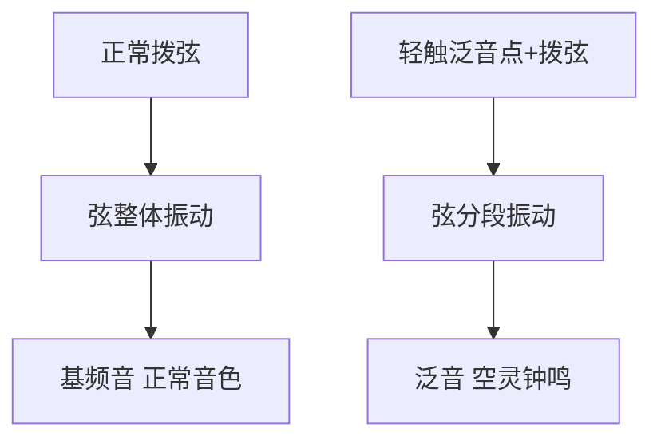
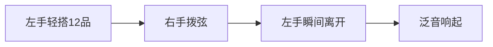
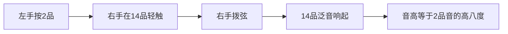
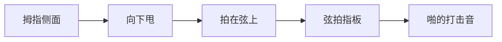

## 一、泛音的原理

### 1.1 什么是泛音

正常拨弦，弦整体振动，发出"基频"音。如果轻触弦的某个特殊点（泛音点）再拨弦，弦会分段振动，发出一种"钟鸣般"的空灵音色——这就是泛音。



### 1.2 泛音点

弦的 1/2、1/3、1/4、1/5 处是泛音点：

| 位置 | 品位 | 音高（以 6 弦空弦 E 为例） |
|------|------|---------------------------|
| 1/2 | 12 品 | 高八度 E |
| 1/3 | 7 品 | 纯五度 B |
| 1/4 | 5 品 | 纯四度 E（更高八度） |
| 1/5 | 4 品（约） | 大三度 G# |

> **最常用**：12 品泛音（最容易发声，高八度音）。

---

## 二、自然泛音

### 2.1 指法

1. 左手手指**轻搭**在弦上（不要按下去！）
2. 右手拨弦
3. **拨响瞬间，左手立刻离开**
4. 泛音响起



### 2.2 动作要领

| 错误 | 正确 |
|------|------|
| 左手按下去 | 轻触即可，像摸羽毛 |
| 左手留在弦上太久 | 拨响瞬间立刻离开 |
| 拨弦点远离泛音点 | 拨在泛音点和琴桥之间 |
| 力度太小 | 用一定力度拨 |

> **关键时机**：拨弦和左手离开几乎同时，差 0.01 秒。早了不响，晚了闷住。

### 2.3 12 品泛音练习

在 6 根弦的 12 品都试一遍：

```
6弦12品: E（高八度）
5弦12品: A
4弦12品: D
3弦12品: G
2弦12品: B
1弦12品: E
```

依次拨响，每个音应该是空灵的钟鸣声。

### 2.4 12 品泛音版《E 弦上的咏叹调》

```
1弦12品 - 1弦12品 - 2弦12品 - 3弦12品
   E       E        B       G
```

---

## 三、人工泛音

### 3.1 原理

左手按住某个品位，右手在"按音的高 12 品位置"轻触+拨弦，产生该按音的高八度泛音。



### 3.2 指法

右手用 **i 指轻触** + **a 指拨弦**（或用拇指 + 食指）：

1. 左手按住目标音（如 2 品）
2. 右手 i 指轻触"目标音 + 12 品"的位置（如 14 品）
3. 右手 a 指拨弦
4. i 指瞬间离开

> **难点**：右手要在"按音 + 12"的位置精准轻触，且 i、a 指协调。

### 3.3 练习

先练 12 品自然泛音找感觉，再练人工泛音：

```
左手按2品 → 右手在14品做人工泛音
左手按3品 → 右手在15品做人工泛音
左手按5品 → 右手在17品做人工泛音
```

---

## 四、拍弦（Slap）

### 4.1 什么是拍弦

用拇指侧面"拍打"琴弦，让弦拍在指板上发出"啪"的打击音。常用于放克、流行节奏。

```
正常音: 咚
拍弦:   咚啪！（带打击效果）
```

### 4.2 动作要领

1. 右手拇指**侧面**（靠近掌心那侧）
2. 像"甩手"一样向下甩
3. 拇指侧面拍在琴弦上
4. 拍完后拇指**留在弦上**（不要弹起来）



| 错误 | 正确 |
|------|------|
| 用指尖戳 | 用拇指侧面拍 |
| 拍完弹起 | 留在弦上 |
| 拍得太轻 | 用一定力度，像拍桌子 |

### 4.3 应用节奏型

```
| C: ↓ 拍 ↓ 拍 | Am: ↓ 拍 ↓ 拍 |
  1 & 2 & 3 & 4 &
```

下扫后接拍弦，循环。

---

## 五、轮指（Tremolo）

### 5.1 什么是轮指

用 a-m-i 三指**快速交替拨**同一根弦，产生"持续颤动"的音色，像曼陀林。

```
a m i a m i a m i ...  ← 快速交替
● ● ● ● ● ● ● ● ●
       1弦
```

### 5.2 动作要领

1. a、m、i 三指自然弯曲
2. 依次拨弦（a → m → i → a → m → i...）
3. 三指力度均匀
4. 速度要快，听起来像"连续的音"

| 错误 | 正确 |
|------|------|
| 用手腕带动 | 手指独立发力 |
| 三指力度不一 | 均匀 |
| 太紧张 | 放松，像"扇扇子" |

### 5.3 练习

```
1弦: a m i a m i a m i
60 BPM → 80 → 100 → 120
```

---

## 六、其他技法速览

| 技法 | 效果 | 记号 |
|------|------|------|
| **拍弦打板** | 拍弦同时打击琴身 | T（Tap） |
| **泛音点滑音** | 滑动泛音点，制造"呜呜"声 | — |
| **琶音** | 拇指从低到高快速拨过和弦所有音 | 箭头 |
| **颤音揉弦** | 按弦手指左右微动，让音"颤抖" | ~ |
| **推弦** | 把弦横向推拉，改变音高 | b（bend） |

### 揉弦

按住一个音拨响后，左手手指**沿弦方向**微小左右移动，让音高微微波动：

```
拨响 → 手指左右微动 → 音"颤抖"
```

> **注意**：古典揉弦是"上下"（沿弦方向），电吉他揉弦是"推拉"（垂直弦方向）。

---

## 七、本章练习

### 练习 1：12 品泛音

6 根弦的 12 品泛音各弹 4 次，每次都要响。不响就重来。

### 练习 2：拍弦节奏型

```
| C: ↓ 拍 ↓ 拍 | 循环
  1 & 2 & 3 & 4 &
```

下扫后拍弦，交替。

### 练习 3：轮指

1 弦轮指，从 60 BPM 起步，目标 120 BPM 连续 10 秒不乱。

### 练习 4：揉弦

按 C 和弦的 2 弦 1 品，拨响后揉弦 4 拍，听音"颤抖"。

### 练习 5：泛音版《欢乐颂》

```
1弦12品 1弦12品 2弦12品 2弦12品
  E       E       B       B
3弦12品 3弦12品 2弦12品 1弦12品
  G       G       B       E
```

---

## 八、常见误区与 FAQ

| 问题 | 原因 | 解决 |
|------|------|------|
| 泛音不响 | 左手按太重或离开太慢 | 轻触+瞬间离开 |
| 人工泛音找不到位置 | 位置不对 | "按音 + 12 品" |
| 拍弦声音闷 | 用了指尖 | 用拇指侧面 |
| 轮指三指不均 | a 指力量弱 | 单独练 a 指拨弦 |
| 揉弦听起来像抖音 | 移动幅度太大 | 微小移动，控制范围 |

---

## 小结

- **自然泛音**：轻触 12/7/5 品 + 拨弦 + 瞬间离开
- **人工泛音**：左手按音 + 右手在"+12 品"做泛音
- **拍弦**：拇指侧面拍弦，打击音效
- **轮指**：a-m-i 快速交替拨同一弦
- **揉弦**：手指微动，音颤抖

下一章：弹唱实战曲目。
