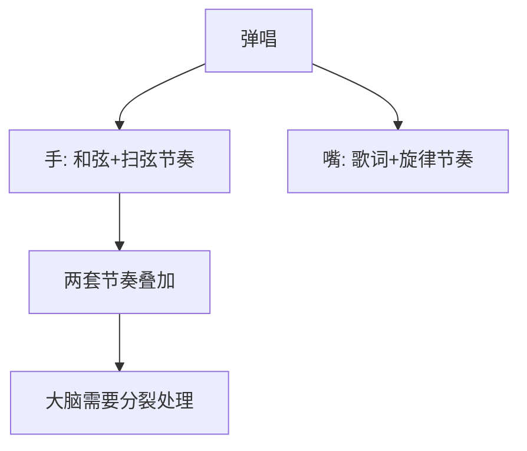

## 一、弹唱的核心难点

弹唱 = **嘴和手做不同节奏的事**。难点在于大脑要同时处理两套节奏。



### 突破方法

1. **先弹熟**：吉他部分练到不需要思考
2. **再唱熟**：不拿吉他把歌唱熟
3. **慢速合并**：极慢速度，嘴里念歌词+手上弹
4. **逐渐加速**：能稳定后再提速

---

## 二、曲目 1：《童年》

### 2.1 曲目信息

- **调式**：C 大调
- **和弦**：C G Am Em F Dm
- **节奏**：万能扫弦 ↓ ↓ ↑ ↑ ↓ ↑
- **速度**：约 90 BPM

### 2.2 和弦走向

主歌：
```
| C - G - | Am - Em - | F - C - | F - G - |
  池塘边的榕树上        知了在声声叫着夏天

| C - G - | Am - Em - | F - G - | C - - - |
  操场边的秋千上        还有蝴蝶停在上面
```

副歌：
```
| F - G - | Em - Am - | F - G - | C - - - |
  等待着下课 等待着放学  等待游戏的童年
```

### 2.3 扫弦节奏

```
| ↓ ↓ ↑ ↑ ↓ ↑ |  循环
  1 2 & 3 & 4 &
```

每小节 4 拍，每拍分配到和弦变化。

### 2.4 弹唱对位

```
歌词: 池塘 边的 榕树 上
和弦: C    C   G    G
节奏: ↓↓↑↑ ↓↑

歌词: 知了 在声 声叫 着夏天
和弦: Am   Am   Em   F-G
```

> **关键**：歌词的重音要落在扫弦的下扫上。例如"池塘"的"池"落在第 1 拍下扫。

### 2.5 练习步骤

1. 只弹不唱，和弦走向练熟（60 BPM）
2. 只唱不弹，跟原曲唱熟
3. 慢速合并，嘴里念歌词节奏，手弹和弦
4. 加入扫弦，60 BPM
5. 逐渐提速到 90 BPM

---

## 三、曲目 2：《那些年》

### 3.1 曲目信息

- **调式**：C 大调
- **和弦**：C G Am F（4 个和弦循环）
- **节奏**：↓ ↓ ↑ ↑ ↓ ↑ + 分解
- **速度**：约 75 BPM

### 3.2 和弦走向

整首歌基本就是 4 和弦循环：

```
| C - G - | Am - F - | 循环
  那些年错过的大雨      那些年错过的爱情
```

> **特点**：4 和弦循环是华语流行歌最爱的进行之一。

### 3.3 前奏分解

主歌用分解和弦（53231323），副歌改扫弦：

```
主歌: | C: 53231323 | G: 63231323 | Am: 53231323 | F: 43231323 |
副歌: | ↓ ↓ ↑ ↑ ↓ ↑ | 循环
```

### 3.4 弹唱对位

```
歌词: 那些 年错 过的 大雨
和弦: C    C   G    G
分解: 5 3 2 3 1 3 2 3

歌词: 那些 年错 过的 爱情
和弦: Am   Am   F    F
```

> **要点**：分解的"5"（根音）要弹在歌词的重音上。

### 3.5 练习步骤

1. 分解和弦练熟，60 BPM
2. 扫弦练熟，60 BPM
3. 主歌分解 + 副歌扫弦的切换
4. 慢速弹唱合并
5. 提速到 75 BPM

---

## 四、曲目 3：《Wonderwall》（Oasis）

### 4.1 曲目信息

- **原调**：F#小调，**用 Capo 2 品 + Em 指法**
- **和弦**：Em7 G Dsus4 A7sus4（简化为 Em G D A）
- **节奏**：↓ ↑ - ↓ ↑ ↓ ↑（切分）
- **速度**：约 87 BPM

### 4.2 Capo 设置

- Capo 夹 2 品
- 用 Em 调指法
- 实际音高 = F# 调

### 4.3 和弦走向

```
| Em7 - G - | Dsus4 - A7sus4 - | 循环
```

简化版（新手）：
```
| Em - G - | D - A - | 循环
```

### 4.4 扫弦节奏（切分）

```
| ↓ ↑ - ↓ ↑ ↓ ↑ |
  1 & 2 & 3 & 4 &
```

第 2 拍后半不扫（空拍），制造摇摆感。

### 4.5 特殊技巧

- 第 2 拍后半静音（用右手手掌轻触弦）
- 营造"嘟-嘟-（空）-嘟-嘟-嘟"的节奏感

### 4.6 练习步骤

1. Capo 夹 2 品，调音
2. 4 个和弦转换练熟
3. 切分扫弦练熟（注意空拍）
4. 慢速弹唱合并
5. 提速

---

## 五、弹唱的进阶技巧

### 5.1 重音对位

歌词的重音要落在扫弦的下扫上：

```
错误: 我↘的↘心↘里↘只有你没有他
      ↓ ↓ ↓ ↓ （每个字都一样重）

正确: 我的心里只有你没有他
      ↓   ↑ ↓   ↑ ↓ ↑
      ●     ●     ●（重音在"我""只""他"）
```

### 5.2 呼吸与换和弦

利用歌词间的"呼吸间隙"换和弦：

```
歌词: 池塘边的榕树上（停顿换和弦）知了...
和弦: C → G          Am
```

> **技巧**：在歌词的逗号、句号处换和弦，不要在歌词中途换。

### 5.3 情绪处理

| 段落 | 处理 |
|------|------|
| 主歌 | 分解和弦，弱 |
| 预副 | 渐强 |
| 副歌 | 扫弦，强 |
| 桥段 | 极弱或停顿 |
| 最后副歌 | 最强 |

---

## 六、本章练习

### 练习 1：《童年》完整弹唱

目标：90 BPM，从头到尾不停顿。

### 练习 2：《那些年》主副歌切换

主歌分解 → 副歌扫弦，切换处不断。

### 练习 3：录音自查

录下来听，检查：
- 节奏是否稳定
- 歌词重音是否对齐下扫
- 换和弦是否有杂音

### 练习 4：自选一首

挑一首你喜欢的 4 和弦循环歌，自己分析和弦走向，尝试弹唱。

---

## 七、常见误区与 FAQ

| 问题 | 原因 | 解决 |
|------|------|------|
| 一唱手就乱 | 吉他不熟 | 先弹到不用思考 |
| 节奏对不上 | 没拆解 | 慢速念歌词+手打拍 |
| 唱到一半忘和弦 | 不熟 | 多练，形成肌肉记忆 |
| 嗓音跟不上原调 | 调不合适 | 用 Capo 降调 |
| 弹唱没感情 | 力度单一 | 加入强弱对比 |

---

## 小结

- **弹唱核心**：手弹熟 → 唱熟 → 慢速合并 → 提速
- **4 和弦循环**：C-G-Am-F 是万能进行
- **重音对位**：歌词重音落在下扫
- **呼吸换和弦**：在歌词停顿处换
- **情绪处理**：主歌弱 → 副歌强

下一章：指弹实战曲目。
