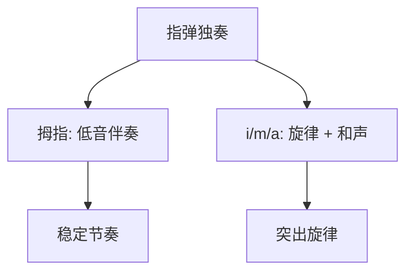
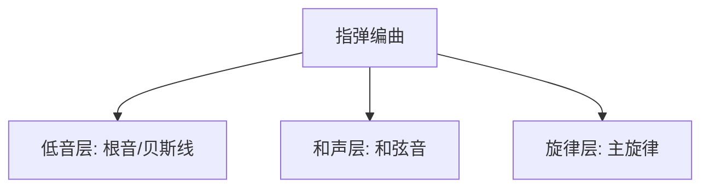

## 一、指弹 vs 弹唱

| | 弹唱 | 指弹 |
|---|---|---|
| 旋律 | 嘴唱 | 吉他弹 |
| 伴奏 | 吉他扫弦 | 吉他分解 |
| 难度 | 中 | 高 |
| 核心 | 节奏稳定 | 旋律+伴奏同时 |

指弹的难点：**一只手同时弹旋律和伴奏**，像一个人当乐队。



---

## 二、曲目 1：《卡农》简化版

### 2.1 曲目信息

- **调式**：C 大调
- **进行**：C - G - Am - Em - F - C - F - G（卡农进行）
- **速度**：约 70 BPM
- **难度**：★★☆（入门）

### 2.2 卡农进行

```
| C - G - | Am - Em - | F - C - | F - G - |
  I   V    vi   iii    IV  I     IV  V
```

> **特点**：低音线"下行"（C→B→A→G→F→E→D→G），是卡农的标志。

### 2.3 简化版指法

每个和弦弹 4 拍，拇指弹低音，其余手指弹旋律：

```
C 和弦（4拍）:
拍1: 5弦3品 (C, 根音)  ← 拇指 p
拍2: 2弦1品 (C, 旋律)  ← 中指 m
拍3: 3弦0品 (G, 和声)  ← 食指 i
拍4: 1弦0品 (E, 旋律)  ← 无名指 a

G 和弦（4拍）:
拍1: 6弦3品 (G, 根音)  ← p
拍2: 1弦0品 (E)        ← a
拍3: 2弦0品 (B)        ← m
拍4: 1弦3品 (G)        ← a（按弦）
```

### 2.4 完整谱（简化版）

```
C          G          Am         Em
5弦3品 1弦0 6弦3品 1弦3 5弦0 1弦0 6弦0 1弦0
3弦0   2弦0 3弦0   1弦0 2弦0   2弦1 3弦0   2弦0
2弦1   3弦0 2弦0   2弦0 1弦0   1弦0 1弦2   1弦0
1弦0   1弦0 1弦3   1弦0 1弦0   1弦2 2弦1   2弦0

F          C          F          G
4弦3品 1弦1 5弦3品 1弦0 4弦3品 1弦1 6弦3品 1弦3
3弦2   2弦1 3弦0   2弦1 3弦2   2弦1 2弦0   2弦0
2弦1   3弦2 2弦1   3弦0 2弦1   3弦2 3弦0   3弦0
1弦1   1弦0 1弦0   1弦0 1弦1   1弦0 1弦3   1弦3
```

> **说明**：每列代表一拍，上为低音（拇指），下为旋律（其余手指）。

### 2.5 旋律突出技巧

```
低音（拇指）: 轻拨，作为背景
旋律（a指）: 稍重拨，突出
```

> **关键**：人耳对高音敏感，所以旋律在第 1 弦（最高音）时最容易突出。

### 2.6 练习步骤

1. **单练低音线**：只用拇指弹每个和弦的根音，60 BPM
2. **单练旋律**：只用 a 指弹第 1 弦旋律
3. **合并**：拇指 + a 指同时，极慢
4. **加入和声**：拇指 + a + i/m，完整版
5. **提速**：60 → 70 BPM

---

## 三、曲目 2：《Romance》简化版

### 3.1 曲目信息

- **调式**：A 小调
- **速度**：约 80 BPM
- **难度**：★★★

### 3.2 前奏（小调色彩）

```
| Am - - - | E - - - | Am - - - | E - - - |

5弦0品 1弦0 6弦0 1弦0 5弦0 1弦1 6弦0 1弦0
3弦2   2弦1 3弦1 2弦0 3弦2 2弦1 3弦1 2弦0
2弦1   3弦2 2弦0 3弦0 2弦1 3弦2 2弦0 3弦0
```

### 3.3 主旋律

利用空弦音的"回响"，制造空灵效果：

```
Am: 5弦0 → 1弦0 → 2弦1 → 1弦0
     低音  旋律  旋律  旋律
     p    a    m    a

E:  6弦0 → 1弦0 → 2弦0 → 1弦0
     低音  旋律  旋律  旋律
```

### 3.4 击勾技巧应用

```
1弦: 0h1p0 0h1p0
     击勾  击勾
```

在旋律中加入击勾装饰，让音更"活"。

### 3.5 练习步骤

1. 单练低音线（5 弦、6 弦交替）
2. 单练旋律（1 弦、2 弦）
3. 合并，60 BPM
4. 加入击勾装饰
5. 提速到 80 BPM

---

## 四、指弹的编曲思路

### 4.1 三层结构



| 层 | 作用 | 弦 | 手指 |
|----|------|-----|------|
| 低音 | 节奏+调性 | 6-4 弦 | p |
| 和声 | 丰满 | 4-2 弦 | i/m |
| 旋律 | 主线 | 1-2 弦 | a/m |

### 4.2 编曲步骤

1. **确定旋律**：先想好主旋律（或来自原曲）
2. **配低音**：每小节第 1 拍弹根音
3. **填和声**：在旋律间隙填和弦音
4. **加技巧**：滑音、击勾、泛音装饰

### 4.3 简化原则

新手编曲时，宁缺毋滥：

```
原曲:    旋律密集 + 复杂和声
简化版:  旋律骨架 + 根音 + 简化和弦
```

> **建议**：先用 1 个低音 + 1 个旋律音开始，能稳定后再加和声。

---

## 五、进阶练习：听音扒谱

### 5.1 什么是扒谱

听原曲，自己把旋律和和弦"扒"出来——这是指弹高手的必备能力。

### 5.2 扒谱步骤

1. **找调**：弹几个音试，确定主音
2. **找旋律**：一句句听，在吉他上找对应音
3. **找和弦**：根据旋律推测和弦（旋律音通常属于当前和弦）
4. **找节奏**：跟节拍器对齐

### 5.3 工具

- **慢速播放**：用软件把原曲降到 50% 速度
- **循环播放**：一句句循环
- **调音器**：辅助找音高

---

## 六、本章练习

### 练习 1：卡农简化版

完整弹奏卡农进行，70 BPM，从头到尾不停顿。

### 练习 2：Romance 前奏

弹奏前奏部分，加入击勾装饰。

### 练习 3：自编一段

用 C-G-Am-F 进行，自己编一段简单指弹：
- 拇指弹根音
- a 指在第 1 弦弹 C 大调音阶（C D E F G A B C）
- i/m 在中间填和声

### 练习 4：扒一首简单曲子

选一首简单的儿歌（如《小星星》），自己扒旋律 + 配和弦。

### 练习 5：录音对比

录下自己的指弹，和原版对比，找差距。

---

## 七、常见误区与 FAQ

| 问题 | 原因 | 解决 |
|------|------|------|
| 旋律和低音打架 | 节奏不对齐 | 慢速，对节拍器 |
| 旋律不突出 | 所有音一样响 | 旋律稍重，低音轻 |
| 换和弦时断 | 换和弦慢 | 回练换和弦 |
| 指弹听起来"散" | 缺低音线 | 强化拇指根音 |
| 编不出曲子 | 不熟音阶 | 回第 5 章复习音阶 |

---

## 八、课程总结

### 8.1 学习路径回顾


### 8.2 进阶方向

完成本教程后，可以继续学习：

| 方向 | 内容 |
|------|------|
| **指弹大师** | 押尾光太郎、岸部真郎的曲目 |
| **爵士吉他** | 复杂和弦、即兴 |
| **蓝调** | Shuffle 节奏、即兴 |
| **弗拉门戈** | 轮指、扫弦技巧 |
| **电吉他** | 推弦、效果器、独奏 |
| **编曲** | 自己改编流行歌为指弹 |

### 8.3 持续练习建议

1. **每天 30 分钟基本功**：爬格子 + 音阶 + 换和弦
2. **每周学 1 首新曲**：保持进步
3. **每月录 1 次音**：记录成长
4. **找伙伴**：和琴友交流、合奏

---

## 小结

- **指弹核心**：拇指低音 + a 指旋律 + i/m 和声
- **卡农进行**：I-V-vi-iii-IV-I-IV-V
- **编曲三层**：低音、和声、旋律
- **简化原则**：宁缺毋滥，先稳后繁
- **扒谱能力**：找调 → 找旋律 → 找和弦 → 找节奏

---

> **恭喜完成吉他从零到精通教程！** 持续练习，享受音乐。
