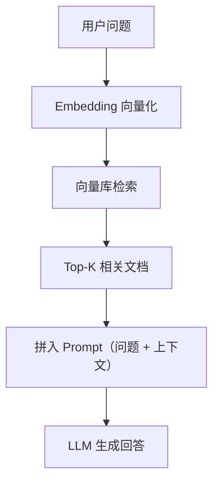

## 一、RAG 原理

RAG（Retrieval-Augmented Generation）= 检索 + 生成。先从知识库检索相关内容，再让 LLM 基于检索结果回答：



**为什么不用 LLM 直接回答？**
- LLM 知识有截止日期
- LLM 不知道你的私有数据
- LLM 可能编造答案（幻觉）

RAG 让 LLM 基于真实文档回答，减少幻觉。

## 二、基础 RAG 链

```python
from langchain_openai import ChatOpenAI, OpenAIEmbeddings
from langchain_chroma import Chroma
from langchain_core.prompts import ChatPromptTemplate
from langchain_core.output_parsers import StrOutputParser
from langchain_core.runnables import RunnablePassthrough, RunnableParallel

# 1. 准备检索器
embeddings = OpenAIEmbeddings(model="text-embedding-3-small")
vectorstore = Chroma(
    persist_directory="./data/chroma_db",
    embedding_function=embeddings,
)
retriever = vectorstore.as_retriever(search_kwargs={"k": 3})

# 2. Prompt 模板
rag_prompt = ChatPromptTemplate.from_messages([
    ("system", """你是客服助手，根据以下参考资料回答用户问题。
如果参考资料中没有相关信息，请说"我暂时无法回答这个问题，建议联系人工客服"。
不要编造信息。

参考资料：
{context}"""),
    ("human", "{question}"),
])

# 3. 格式化文档
def format_docs(docs):
    return "\n\n---\n\n".join(
        f"[来源: {d.metadata.get('source', '未知')}]\n{d.page_content}"
        for d in docs
    )

# 4. 组装 RAG 链
rag_chain = (
    RunnableParallel(
        context=retriever | format_docs,
        question=RunnablePassthrough(),
    )
    | rag_prompt
    | ChatOpenAI(model="gpt-4o-mini", temperature=0)
    | StrOutputParser()
)

# 5. 使用
answer = rag_chain.invoke("退货流程是什么")
print(answer)
```

## 三、create_retrieval_chain

LangChain 提供了更高级的 RAG 链构造器：

```python
from langchain.chains import create_retrieval_chain
from langchain.chains.combine_documents import create_stuff_documents_chain

# 文档处理链
qa_prompt = ChatPromptTemplate.from_messages([
    ("system", """你是客服助手，根据以下参考资料回答问题。
参考资料：
{context}"""),
    ("human", "{input}"),
])

combine_docs_chain = create_stuff_documents_chain(
    llm=ChatOpenAI(model="gpt-4o-mini", temperature=0),
    prompt=qa_prompt,
)

# RAG 链
rag_chain = create_retrieval_chain(retriever, combine_docs_chain)

# 调用
result = rag_chain.invoke({"input": "退货流程是什么"})
print(result["answer"])       # 回答
print(result["context"])      # 检索到的文档
```

## 四、来源引用

让回答标注信息来源，增强可信度：

```python
from pydantic import BaseModel, Field

class CitedAnswer(BaseModel):
    """带来源引用的回答"""
    answer: str = Field(description="回答内容")
    sources: list[str] = Field(description="引用的文档来源")
    confidence: float = Field(ge=0, le=1, description="置信度")

llm = ChatOpenAI(model="gpt-4o-mini", temperature=0)
structured_llm = llm.with_structured_output(CitedAnswer)

cited_chain = (
    RunnableParallel(
        context=retriever | format_docs,
        question=RunnablePassthrough(),
    )
    | rag_prompt
    | structured_llm
)

result = cited_chain.invoke("退货流程是什么")
print(f"回答: {result.answer}")
print(f"来源: {result.sources}")
print(f"置信度: {result.confidence}")
```

## 五、重排序（Reranking）

向量检索按语义相似度排序，但最相似的不一定最相关。重排序用交叉编码器重新评分：

```python
from langchain_community.document_compressors import CohereRerank

# 使用 Cohere Rerank（需要 API Key）
compressor = CohereRerank(top_n=3)

from langchain.retrievers import ContextualCompressionRetriever
compression_retriever = ContextualCompressionRetriever(
    base_compressor=compressor,
    base_retriever=retriever,
)

# 先检索 10 个，再重排序取 3 个
results = compression_retriever.invoke("退货流程")
```

**简单替代方案**：用 LLM 做重排序：

```python
from langchain_core.prompts import ChatPromptTemplate

rerank_prompt = ChatPromptTemplate.from_messages([
    ("system", """对以下文档按与问题的相关性打分（0-10），只返回分数最高的3个的编号。
问题：{question}
文档：
{docs}"""),
    ("human", "返回最相关的3个文档编号"),
])
```

## 六、客服知识库完整流程

```python
from langchain_openai import ChatOpenAI, OpenAIEmbeddings
from langchain_chroma import Chroma
from langchain_core.prompts import ChatPromptTemplate
from langchain_core.output_parsers import StrOutputParser
from langchain_core.runnables import RunnablePassthrough, RunnableParallel

class CustomerServiceRAG:
    """客服 RAG 系统"""

    def __init__(self, persist_dir: str = "./data/chroma_db"):
        self.embeddings = OpenAIEmbeddings(model="text-embedding-3-small")
        self.vectorstore = Chroma(
            persist_directory=persist_dir,
            embedding_function=self.embeddings,
        )
        self.retriever = self.vectorstore.as_retriever(
            search_type="mmr",
            search_kwargs={"k": 3, "fetch_k": 10},
        )
        self.llm = ChatOpenAI(model="gpt-4o-mini", temperature=0)
        self.chain = self._build_chain()

    def _build_chain(self):
        prompt = ChatPromptTemplate.from_messages([
            ("system", """你是电商客服助手"小助手"，根据参考资料回答问题。
规则：
1. 只基于参考资料回答，不编造信息
2. 参考资料中没有的，说"我暂时无法回答，建议联系人工客服"
3. 回答简洁，不超过200字
4. 涉及订单操作时，先确认订单号

参考资料：
{context}"""),
            ("human", "{question}"),
        ])

        def format_docs(docs):
            return "\n\n---\n\n".join(
                f"[{d.metadata.get('source', '未知')}]\n{d.page_content}"
                for d in docs
            )

        return (
            RunnableParallel(
                context=self.retriever | format_docs,
                question=RunnablePassthrough(),
            )
            | prompt
            | self.llm
            | StrOutputParser()
        )

    def ask(self, question: str) -> str:
        return self.chain.invoke(question)

# 使用
service = CustomerServiceRAG()
print(service.ask("退货流程是什么"))
print(service.ask("iPhone 15 Pro 保修期多久"))
```

## 七、小结

| 概念 | 用途 |
|------|------|
| RAG | 检索 + 生成，减少幻觉 |
| create_retrieval_chain | 高级 RAG 链构造 |
| 来源引用 | 标注信息来源 |
| MMR 检索 | 减少重复结果 |
| 重排序 | 提升检索精度 |

---

上一篇：[向量存储与检索](/docs/langchain/08向量存储与检索.html)

下一篇：[Agent 与工具调用](/docs/langchain/10Agent与工具调用.html)
