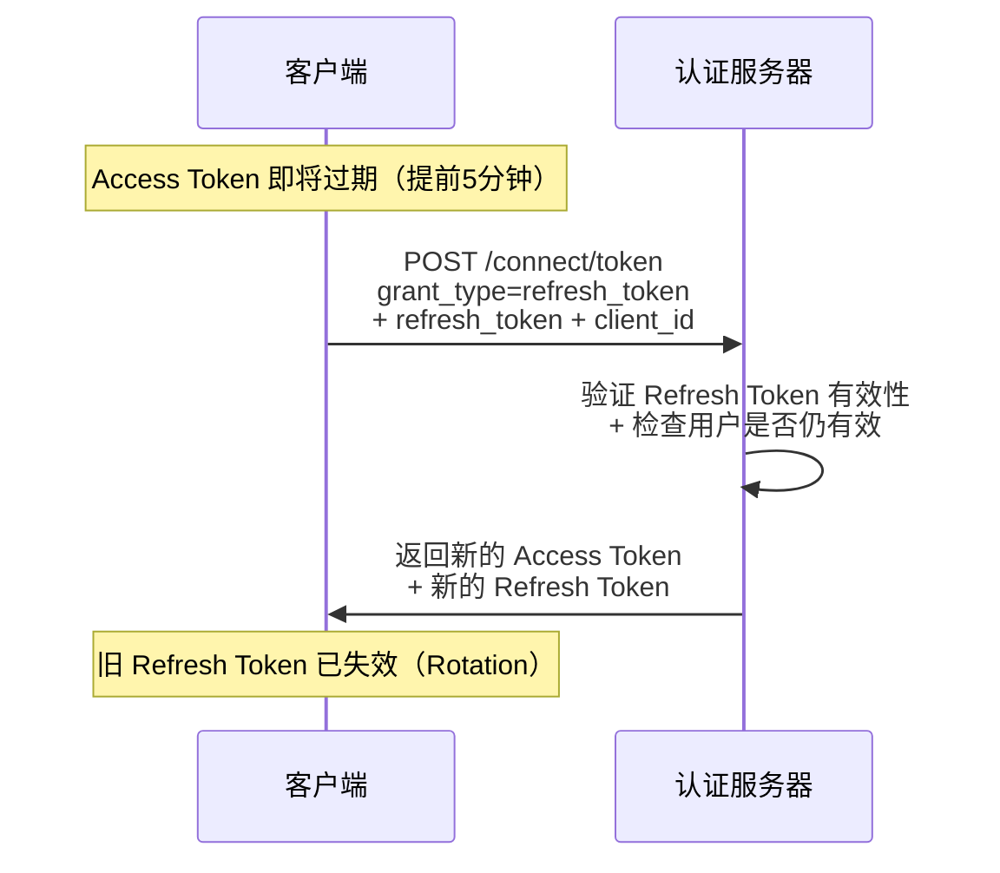

---
layout: TutorialLayout
title: OpenIddict 令牌管理
date: 2026-06-05
category: tech
tags: .NET, OpenIddict, Refresh Token, 令牌撤销, 引用令牌
summary: 全面讲解令牌管理的核心话题：刷新令牌机制、令牌撤销（即时 vs 过期）、引用令牌、令牌加密、安全最佳实践
---

## 一、三种令牌

OpenIddict 在授权码/刷新令牌流程中签发三种令牌，各有用途：

| 令牌 | 格式 | 用途 | 谁使用 | 有效期 |
| --- | --- | --- | --- | --- |
| Access Token | JWT（自包含） | 访问资源服务器 | 客户端 | 短（默认1小时） |
| ID Token | JWT（自包含） | 传递用户身份给客户端 | 客户端前端 | 与 Access Token 相同 |
| Refresh Token | 不透明字符串 | 换取新 Access Token | 仅客户端后端 | 长（默认14天） |

### 1.1 JWT vs 不透明令牌

- **JWT（Access Token）**：自包含，资源服务器只需要公钥就能验证，不需要网络请求。但一旦签发，无法在过期前撤销。
- **不透明令牌（Refresh Token）**：客户端无法解读，每次使用时必须到认证服务器验证，可以被即时撤销。

**这就是为什么 Access Token 要短命，Refresh Token 要长命**：Access Token 无法撤销，只能让它尽快过期；Refresh Token 可以即时撤销，所以可以给更长的有效期。

## 二、刷新令牌机制

### 2.1 工作原理



### 2.2 何时刷新

客户端应该在 Access Token **过期前 1-5 分钟**主动刷新，不要等到过期后再刷——过期后所有 API 请求都会失败，直到拿到新令牌。

```csharp title="客户端刷新令牌"
public async Task<string> EnsureAccessTokenAsync()
{
    // 令牌还有 5 分钟以上余量
    if (DateTimeOffset.UtcNow < _expiresAt.AddMinutes(-5))
        return _cachedAccessToken;

    // 尝试用 Refresh Token 换取新令牌
    var response = await _httpClient.PostAsync(_tokenEndpoint, new FormUrlEncodedContent(new Dictionary<string, string>
    {
        ["grant_type"] = "refresh_token",
        ["refresh_token"] = _cachedRefreshToken,
        ["client_id"] = _clientId,
        ["client_secret"] = _clientSecret
    }));

    var payload = JsonDocument.Parse(await response.Content.ReadAsStringAsync());

    _cachedAccessToken = payload.RootElement.GetProperty("access_token").GetString()!;
    _cachedRefreshToken = payload.RootElement.GetProperty("refresh_token").GetString()!; // 新的 Refresh Token
    var expiresIn = payload.RootElement.GetProperty("expires_in").GetInt32();
    _expiresAt = DateTimeOffset.UtcNow.AddSeconds(expiresIn);

    return _cachedAccessToken;
}
```

### 2.3 Refresh Token Rotation

OpenIddict 默认启用 **Rotation**——每次使用 Refresh Token 时，旧的自动失效，并签发一个新的。

这意味着：
- 客户端必须保存每次刷新后返回的**新** Refresh Token
- 如果旧 Refresh Token 被重放（被攻击者使用），说明泄露了
- OpenIddict 会检测到重放并撤销整个授权（所有相关令牌全部失效）

> **安全建议**：如果检测到 Refresh Token 重放，立即撤销该用户的所有令牌，并通知用户（可能有账号被盗风险）。

### 2.4 配置令牌有效期

在 `Program.cs` 中配置：

```csharp title="令牌有效期配置"
.AddServer(options =>
{
    options.SetAccessTokenLifetime(TimeSpan.FromHours(1));
    options.SetRefreshTokenLifetime(TimeSpan.FromDays(14));
    options.SetAuthorizationCodeLifetime(TimeSpan.FromMinutes(5));
})
```

| 令牌 | 默认有效期 | 生产建议 |
| --- | --- | --- |
| Access Token | 1小时 | 30分钟-1小时 |
| Refresh Token | 14天 | 7-30天 |
| Authorization Code | 5分钟 | 3-5分钟 |

## 三、令牌撤销

### 3.1 JWT 的局限性

**JWT 是自包含的，无法即时撤销**。即使你把数据库里的令牌标记为已撤销，资源服务器仍然会信任已签发的 JWT（因为公钥验证不查数据库）。

| 策略 | 做法 | 适用场景 |
| --- | --- | --- |
| 等待过期 | Access Token 短命（1小时） | 大多数场景 |
| 引用令牌 | 资源服务器每次查数据库 | 高安全场景 |
| 黑名单 | 在网关层维护撤销列表 | 中等安全 |

### 3.2 撤销端点

OpenIddict 提供撤销端点：

```csharp title="撤销端点配置"
options.SetRevocationEndpointUris("/connect/revoke");
options.AllowRefreshTokenFlow(); // 撤销需要 Refresh Token 支持
```

客户端调用：

```csharp title="撤销令牌"
// 撤销 Refresh Token（用户注销时使用）
await httpClient.PostAsync("https://auth.myapp.com/connect/revoke", new FormUrlEncodedContent(new Dictionary<string, string>
{
    ["token"] = refreshToken,
    ["token_type_hint"] = "refresh_token",
    ["client_id"] = clientId,
    ["client_secret"] = clientSecret
}));
```

**重要**：撤销的是 Refresh Token，不是 Access Token。Access Token 仍然有效直到过期。用户注销后，客户端应该清除本地存储的 Access Token。

### 3.3 服务端即时撤销

如果确实需要即时撤销 Access Token（比如用户被封禁），需要结合其他手段：

```csharp title="即时撤销策略"
// 1. 在数据库中记录撤销事件
await _tokenManager.TryRevokeAsync(tokenId);

// 2. 通过 Redis/SignalR 广播撤销事件给所有资源服务器
await _cache.SetAsync($"revoked:{accessTokenJti}", true, TimeSpan.FromMinutes(60));

// 3. 资源服务器验证时检查撤销列表
// （需要在自定义验证事件中实现，见下文）
```

## 四、引用令牌（Reference Token）

引用令牌是 JWT 的替代方案：令牌本身只是随机字符串，实际内容存储在数据库中。资源服务器每次验证时查询数据库（内省端点）。

### 4.1 何时使用

- 令牌包含敏感信息，不想让客户端看到
- 需要即时撤销能力
- 对性能要求不高（每次验证有网络开销）

### 4.2 配置

```csharp title="启用引用令牌"
.AddServer(options =>
{
    // 启用引用令牌功能
    options.EnableAuthorizationRequestDecryption()
           .EnableTokenRequestDecryption();

    // 对特定客户端启用引用令牌（可选，也可以在令牌创建时设置 Type）
})
```

在创建令牌时指定类型：

```csharp title="创建引用令牌"
// 在令牌端点或自定义逻辑中
var token = await _tokenManager.CreateAsync(new OpenIddictTokenDescriptor
{
    ApplicationId = applicationId,
    Type = OpenIddictConstants.TokenTypeHints.AccessToken,
    // 标记为引用令牌
    Payload = serializedToken,
    Status = OpenIddictConstants.Statuses.Valid
});
```

### 4.3 资源服务器验证引用令牌

资源服务器使用**内省端点**验证引用令牌（详见[第三篇](/docs/openiddict/03客户端凭证与资源服务器.html)方式三）：

```csharp title="内省验证"
.AddValidation(options =>
{
    options.UseIntrospection()
        .SetIntrospectionEndpointUri(new Uri("https://auth.myapp.com/connect/introspect"))
        .SetClientId("resource_server")
        .SetClientSecret("resource_server_secret");
})
```

### 4.4 JWT vs 引用令牌

| 对比项 | JWT | 引用令牌 |
| --- | --- | --- |
| 验证方式 | 本地公钥 | 内省端点（网络请求） |
| 即时撤销 | 不支持 | 支持 |
| 性能 | 快 | 慢（每次网络往返） |
| 内容可见 | 客户端可解码 | 客户端看不到内容 |
| 适用场景 | 高并发、无即时撤销需求 | 高安全、需即时撤销 |

## 五、令牌加密

### 5.1 签名 vs 加密

- **签名**：防篡改（客户端可以读内容，但改不了）—— Access Token
- **加密**：防泄露（客户端完全读不到内容）—— Refresh Token

### 5.2 OpenIddict 的加密机制

OpenIddict 默认对 Refresh Token 加密：

```csharp title="启用令牌加密（生产环境）"
.AddServer(options =>
{
    // 加密证书（保护 Refresh Token）
    options.AddEncryptionCertificate(
        new X509Certificate2("encryption.pfx", "password"));
})
```

- 签名证书：用于签名 Access Token，资源服务器用公钥验证
- 加密证书：用于加密 Refresh Token，只有认证服务器能解密

> **安全建议**：生产环境中加密和签名证书要分开，且从环境变量或 Key Vault 加载，不要硬编码。

## 六、安全最佳实践

### 6.1 Access Token 有效期

**1小时以内**。太长会增加被盗用的风险窗口。

```csharp
options.SetAccessTokenLifetime(TimeSpan.FromMinutes(30));
```

### 6.2 Refresh Token 安全

- 启用 Rotation（默认已启用）
- 检测重放，撤销整个授权
- 长期不活跃的用户自动过期

```csharp title="检测 Refresh Token 重放"
// 在令牌端点的刷新流程中
if (request.IsRefreshTokenGrantType())
{
    var result = await HttpContext.AuthenticateAsync(/*...*/);

    // 如果 Refresh Token 被撤销，说明有重放攻击
    if (result.Principal?.GetClaim("refresh_token_id") is string tokenId)
    {
        var token = await _tokenManager.FindByIdAsync(tokenId);
        if (token == null || token.Status != "valid")
        {
            // 重放！撤销该授权的所有令牌
            await _authorizationManager.PruneAsync(DateTimeOffset.UtcNow);
            return Forbid(/*...*/);
        }
    }
}
```

### 6.3 令牌存储

| 存储位置 | 安全性 | 适用场景 |
| --- | --- | --- |
| HttpOnly Cookie | 高（JS 不可读） | 有后端的 Web 应用 |
| SessionStorage | 中（关闭标签失效） | 临时会话 |
| LocalStorage | 低（XSS 可偷） | 不推荐 |
| 内存变量 | 高（页面刷新丢失） | SPA 短期会话 |

### 6.4 敏感 API 二次验证

对于高危操作（修改密码、转账），仅靠 Access Token 不够：

```csharp title="二次验证"
[HttpPost("change-password")]
[Authorize]
public async Task<IActionResult> ChangePassword(ChangePasswordRequest req)
{
    // 要求最近 5 分钟内重新验证过身份
    var authTime = User.FindFirst("auth_time")?.Value;
    if (authTime == null || DateTimeOffset.UtcNow.ToUnixTimeSeconds() - long.Parse(authTime) > 300)
    {
        return BadRequest("请重新验证身份");
    }
    // ... 执行密码修改
}
```

> **下一篇**：[自定义扩展与踩坑](/docs/openiddict/05自定义扩展与踩坑.html) —— 自定义实体和 Store、与 ASP.NET Core Identity 集成、常见踩坑排查。