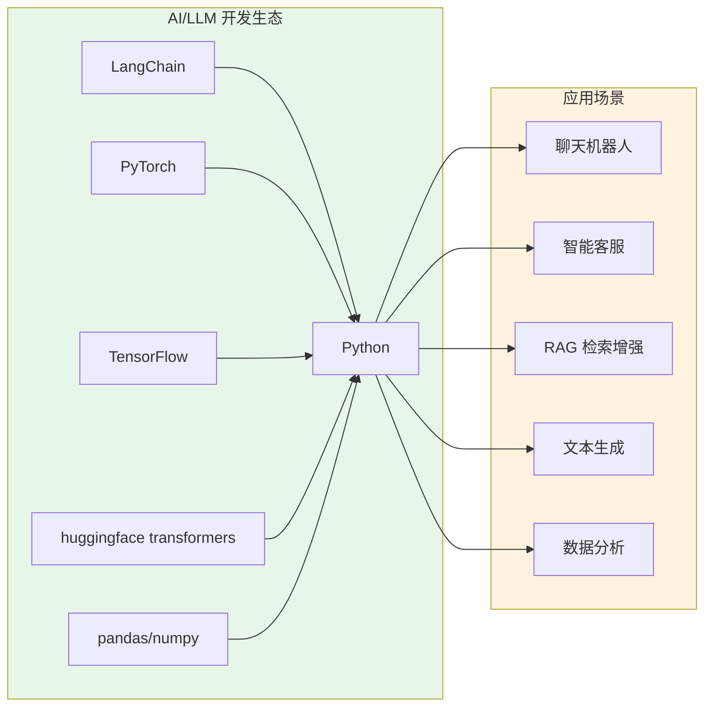
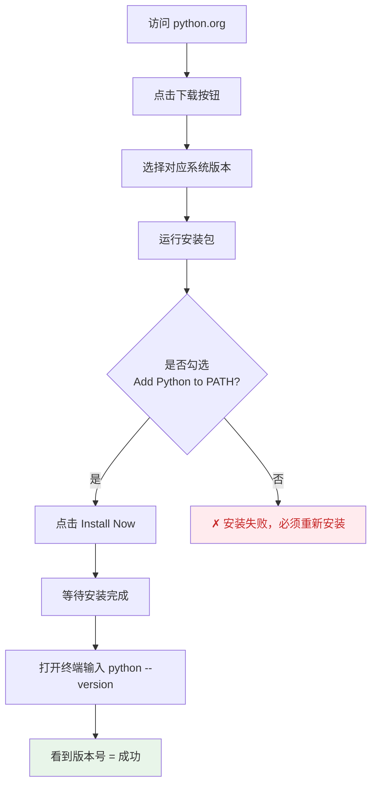

## 一、为什么学 Python

Python 是目前世界上最流行的编程语言之一，尤其在人工智能、数据科学和自动化领域占据绝对主导地位。如果你打算学习 LangChain、大语言模型应用开发，Python 是唯一的选择。

### 1.1 Python 是什么

Python 是一门**解释型、高级、通用**的编程语言。它的核心理念是 **"可读性至上"** —— 代码像伪代码一样清晰，让开发者专注于解决问题本身，而不是语言细节。

```python
# Python：代码即文档
def greet(name: str) -> str:
    """向用户打招呼"""
    return f"你好，{name}！"

print(greet("世界"))  # 输出：你好，世界！
```

对比其他语言，Python 的优势一目了然：

| 特性 | Python | Java | C++ | JavaScript |
|------|--------|------|-----|------------|
| 语法简洁度 | ★★★★★ | ★★ | ★ | ★★★ |
| AI/ML 生态 | ★★★★★ | ★ | ★★ | ★★ |
| 学习曲线 | 平缓 | 陡峭 | 陡峭 | 中等 |
| 运行速度 | 较慢 | 快 | 极快 | 中等 |
| 跨平台 | ✓ | ✓ | ✓ | ✓ |

### 1.2 Python 在 AI 开发中的角色



**关键点**：几乎所有主流的 AI/LLM 框架都用 Python 作为首选语言。学会 Python，你就站在了 AI 开发的核心圈。

### 1.3 Python 不是什么

| 误解 | 事实 |
|------|------|
| Python 什么都擅长 | Python 在网页前端、移动端开发上不是最佳选择 |
| Python 很慢所以没用 | 核心计算用 C/C++ 扩展（如 numpy），Python 只做胶水层，实际性能很好 |
| Python 不需要理解原理 | 越简单的语言越需要你理解底层逻辑，否则写出的代码又慢又丑 |

## 二、环境搭建

### 2.1 系统要求

| 平台 | 最低要求 |
|------|---------|
| Windows | Windows 10 64-bit |
| macOS | macOS 10.13+ |
| Linux | 任意现代发行版 |

### 2.2 安装 Python

**方式一：官网下载安装（推荐新手）**

1. 访问 [python.org/downloads](https://www.python.org/downloads/)
2. 下载最新稳定版（当前 3.12.x）
3. **Windows 用户注意**：安装时务必勾选 **"Add Python to PATH"**



**方式二：使用包管理器（macOS/Linux）**

```bash title="macOS"
# macOS（需要安装 Homebrew）
brew install python3
```
```bash title="Ubuntu/Debian"
# Ubuntu/Debian
sudo apt update
sudo apt install python3 python3-pip python3-venv
```
```bash title="Fedora"
# Fedora
sudo dnf install python3
```

### 2.3 验证安装

打开终端（Windows 用 PowerShell 或 CMD），运行：

```bash
# 检查 Python 版本
python --version
# 或
python3 --version

# 预期输出：Python 3.12.x
```

```bash
# 检查 pip（包管理器）版本
pip --version
# 或
pip3 --version
```

### 2.4 虚拟环境：每个项目隔离依赖

虚拟环境（virtual environment）是 Python 开发的最佳实践。每个项目有自己的 Python 环境和依赖包，互不干扰。

```bash
# 1. 进入项目目录
mkdir my_project
cd my_project

# 2. 创建虚拟环境
python -m venv .venv

# 3. 激活虚拟环境
# Windows：
.venv\Scripts\activate
# macOS/Linux：
source .venv/bin/activate

# 激活后，命令行前会出现 (.venv) 标识
# 4. 验证
python --version

# 5. 退出虚拟环境
deactivate
```

> **为什么需要虚拟环境？**
> 想象你有两个项目：项目 A 需要 `requests==2.28.0`，项目 B 需要 `requests==2.31.0`。如果没有虚拟环境，你无法同时安装这两个版本。虚拟环境让每个项目拥有独立的 `site-packages` 目录。

### 2.5 IDE 选择

| IDE | 推荐度 | 说明 |
|-----|--------|------|
| **VS Code** | ★★★★★ | 免费、轻量、Python 扩展完善，本教程首选 |
| **PyCharm Community** | ★★★★☆ | JetBrains 出品，免费，功能强大但较重 |
| **Jupyter Notebook** | ★★★★☆ | 交互式开发，适合数据分析和实验 |

**VS Code 必装扩展：**
- Python (Microsoft) — 语言支持、调试、Linting
- Pylance — 智能代码补全和类型检查
- Jupyter — Notebook 支持

## 三、第一个 Python 程序

### 3.1 Hello World

打开任意文本编辑器（VS Code、Notepad++、甚至记事本），创建一个文件 `hello.py`：

```python title="hello.py"
print("Hello, World!")
```

运行：

```bash
python hello.py
# 输出：Hello, World!
```

就这么简单。`print()` 是 Python 最常用的内置函数，用于在终端输出内容。

### 3.2 交互式编程：REPL

Python 提供了一个交互式解释器（REPL：Read-Eval-Print Loop），你可以逐行输入代码并立即看到结果：

```bash
python
>>> 1 + 2
3
>>> "Hello" + " " + "World"
'Hello World'
>>> print("你好，世界！")
你好，世界！
>>> exit()  # 退出 REPL
```

> **新手技巧**：学习 Python 时，多用 REPL 试验各种写法。这是最快的学习方式。

### 3.3 Python 代码的基本结构

```python
# 1. 注释：# 开头，不会被执行，用于说明代码
# 2. 空行：PEP 8 建议用空行分隔逻辑块
# 3. 语句：每行一条语句，不需要分号

# 这是一条赋值语句
greeting = "你好"

# 这是一条函数调用
print(f"{greeting}，世界！")

# 多行字符串用三个引号
long_text = """
这是多行字符串。
它可以包含换行符。
常用于文档字符串（docstring）。
"""
```

### 3.4 PEP 8：Python 编码规范

PEP 8 是 Python 的官方编码风格指南，虽然不是强制的，但遵守它能让你的代码更专业：

| 规则 | 示例 |
|------|------|
| 缩进使用 4 个空格 | `def foo():\n    pass` |
| 每行不超过 79 字符 | 长代码用括号隐式换行 |
| 变量名用小写下划线 | `user_name` 而非 `userName` |
| 类名用驼峰命名 | `UserProfile` 而非 `user_profile` |
| 常量用全大写 | `MAX_RETRIES = 3` |

## 四、Python 基础概念速览

在进入正式章节前，先快速了解 Python 的核心数据类型。

### 4.1 基本数据类型

```python
# 整数 int
age = 25
population = 8_000_000_000  # 可以用下划线分隔数字

# 浮点数 float
price = 19.99
pi = 3.1415926535

# 布尔值 bool
is_python_great = True
has_rain = False

# 字符串 str
name = "Python"
greeting = 'Hello, World!'
multi_line = """多行字符串"""

# 查看类型
print(type(age))      # <class 'int'>
print(type(price))    # <class 'float'>
print(type(name))     # <class 'str'>
print(type(is_python_great))  # <class 'bool'>
```

### 4.2 变量与赋值

```python
# Python 是动态类型语言：变量不需要声明类型
x = 10        # x 是 int
x = "hello"   # x 变成了 str，Python 允许这样
x = [1, 2, 3] # x 又变成了 list

# 多重赋值
a, b, c = 1, 2, 3
x = y = z = 0

# 交换变量（Python 独有优雅写法）
first, second = "Python", "LangChain"
first, second = second, first  # 现在 first="LangChain", second="Python"
```

### 4.3 常用运算符

```python
# 算术运算
print(10 + 3)   # 13  加
print(10 - 3)   # 7   减
print(10 * 3)   # 30  乘
print(10 / 3)   # 3.333...  除（总是返回 float）
print(10 // 3)  # 3   整除（返回 int）
print(10 % 3)   # 1   取余
print(10 ** 3)  # 1000 幂

# 比较运算
print(10 == 10)  # True  等于
print(10 != 5)   # True  不等于
print(10 > 5)    # True  大于
print(10 <= 10)  # True  小于等于

# 逻辑运算
print(True and False)   # False
print(True or False)    # True
print(not True)         # False
```

### 4.4 类型转换

```python
# 显式转换
int("42")        # 42
float("3.14")    # 3.14
str(100)         # "100"
bool(1)          # True
bool(0)          # False
bool("")         # False  （空字符串为 False）
bool("hello")    # True

# 常用场景
age = input("请输入年龄：")  # 输入返回的是字符串
age_int = int(age)           # 转换为整数
print(f"明年你 {age_int + 1} 岁")
```

## 五、下一步

到这里，你已经完成了：
- ✅ 理解了 Python 的定位和在 AI 开发中的作用
- ✅ 安装了 Python 并配置了虚拟环境
- ✅ 编写并运行了第一个程序
- ✅ 了解了基本数据类型和运算符

下一章我们将深入 Python 的语法核心：**Python 速览**，系统学习变量、类型、输入输出和格式化字符串。

### 本章练习

1. 在终端中运行 `python --version`，确认 Python 版本
2. 创建虚拟环境，在其中安装 `requests` 库：`pip install requests`
3. 写一个程序，输入你的名字和年龄，输出："你好，[名字]！你今年 [年龄] 岁，明年 [年龄+1] 岁。"
4. 在 REPL 中尝试 `10 / 3` 和 `10 // 3`，观察区别
