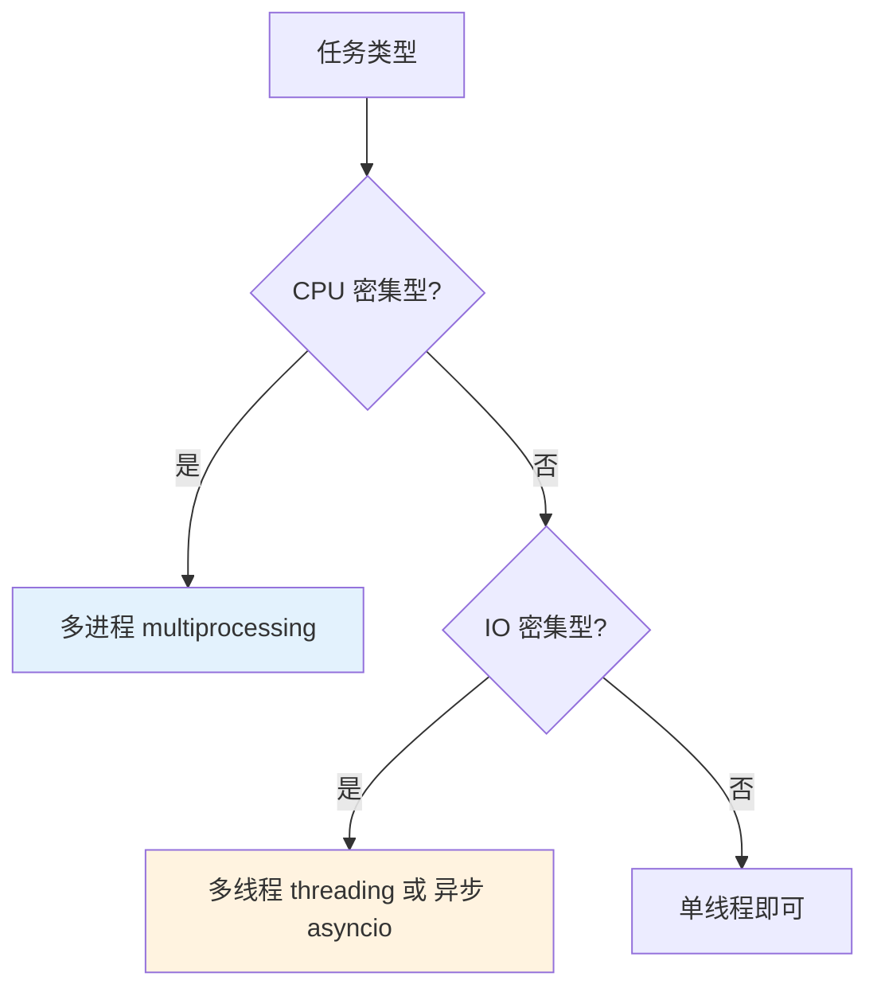

## 一、为什么 Python 并发是个话题

Python 有一个著名的限制：**GIL（全局解释器锁）**。同一时刻只有一个线程在执行 Python 字节码。这意味着：

- **多线程**：适合 IO 密集型（网络请求、文件读写）
- **多进程**：适合 CPU 密集型（数值计算、图像处理）
- **异步**：IO 密集型的轻量级替代方案



## 二、多线程（threading）

### 2.1 基本用法

```python
import threading
import time

def download(url):
    print(f"开始下载：{url}")
    time.sleep(2)  # 模拟网络延迟
    print(f"完成下载：{url}")

# 创建线程
threads = []
urls = ["https://api.example.com/data/1", "https://api.example.com/data/2", "https://api.example.com/data/3"]

for url in urls:
    t = threading.Thread(target=download, args=(url,))
    threads.append(t)
    t.start()

# 等待所有线程完成
for t in threads:
    t.join()

print("所有下载完成")
```

> **关键**：`threading.Thread` 创建线程，`start()` 启动，`join()` 等待完成。多个线程可以同时运行，但由于 GIL，CPU 密集型任务不会真正加速。

### 2.2 ThreadPoolExecutor（推荐）

```python
from concurrent.futures import ThreadPoolExecutor, as_completed
import time

def fetch_url(url):
    """模拟网络请求"""
    time.sleep(1)
    return f"{url} - 200 OK"

urls = [f"https://api.example.com/{i}" for i in range(5)]

# 线程池：最多 3 个线程并发
with ThreadPoolExecutor(max_workers=3) as executor:
    # submit：提交任务
    futures = {executor.submit(fetch_url, url): url for url in urls}
    
    # as_completed：按完成顺序返回
    for future in as_completed(futures):
        url = futures[future]
        try:
            result = future.result()
            print(result)
        except Exception as e:
            print(f"{url} 出错：{e}")

# 使用 map（更简洁，按顺序返回）
with ThreadPoolExecutor(max_workers=3) as executor:
    results = executor.map(fetch_url, urls)
    for result in results:
        print(result)
```

### 2.3 线程安全的共享数据

```python
import threading

counter = 0
lock = threading.Lock()

def safe_increment():
    global counter
    for _ in range(10000):
        with lock:  # 自动获取和释放锁
            counter += 1

threads = [threading.Thread(target=safe_increment) for _ in range(5)]
for t in threads:
    t.start()
for t in threads:
    t.join()

print(counter)  # 50000（正确值）
```

## 三、多进程（multiprocessing）

### 3.1 基本用法

```python
from multiprocessing import Process, Pool
import time

def cpu_bound_task(n):
    """CPU 密集型任务"""
    total = 0
    for i in range(n):
        total += i ** 2
    return total

if __name__ == "__main__":
    # Process 方式
    processes = []
    for i in range(4):
        p = Process(target=cpu_bound_task, args=(10_000_000,))
        processes.append(p)
        p.start()
    
    for p in processes:
        p.join()
    
    # Pool 方式（更简洁）
    with Pool(processes=4) as pool:
        results = pool.map(cpu_bound_task, [10_000_000] * 4)
        print(results)
```

### 3.2 进程间通信

```python
from multiprocessing import Queue, Pipe

# Queue：线程/进程安全的队列
q = Queue()
q.put("hello")
q.put(42)
item = q.get()  # "hello"

# Pipe：双向通信
parent_conn, child_conn = Pipe()
parent_conn.send("from parent")
msg = child_conn.recv()  # "from parent"
```

## 四、异步编程（asyncio）

### 4.1 基本概念

```python
import asyncio

async def fetch_data(url):
    """异步函数：模拟网络请求"""
    print(f"请求：{url}")
    await asyncio.sleep(1)  # 非阻塞等待
    print(f"完成：{url}")
    return f"{url} 的数据"

# 运行异步任务
result = asyncio.run(fetch_data("https://api.example.com"))
print(result)
```

### 4.2 并发异步任务

```python
import asyncio

async def fetch_api(endpoint):
    """模拟 API 调用"""
    await asyncio.sleep(0.5)
    return f"{endpoint} 响应"

async def main():
    # gather：并发执行多个协程
    results = await asyncio.gather(
        fetch_api("/users"),
        fetch_api("/posts"),
        fetch_api("/comments"),
    )
    for r in results:
        print(r)
    
    # 也可以逐个等待
    tasks = [fetch_api(f"/data/{i}") for i in range(5)]
    for task in asyncio.as_completed(tasks):
        result = await task
        print(result)

asyncio.run(main())
```

### 4.3 异步生产者-消费者

```python
import asyncio
import time

async def producer(queue, n):
    """生产者：生成数据放入队列"""
    for i in range(n):
        await queue.put(f"数据-{i}")
        await asyncio.sleep(0.1)
    await queue.put(None)  # 哨兵值，通知消费者停止

async def consumer(queue, name):
    """消费者：从队列取出数据"""
    while True:
        item = await queue.get()
        if item is None:
            queue.task_done()
            break
        print(f"[{name}] 处理：{item}")
        await asyncio.sleep(0.2)
        queue.task_done()

async def main():
    queue = asyncio.Queue(maxsize=5)
    
    # 启动多个消费者
    consumers = [
        asyncio.create_task(consumer(queue, f"C{i}"))
        for i in range(2)
    ]
    
    # 启动生产者
    await producer(queue, 10)
    
    # 等待消费者完成
    await asyncio.gather(*consumers)

asyncio.run(main())
```

### 4.4 信号量（限流）

```python
import asyncio

async def fetch_with_rate_limit(semaphore, url):
    """带速率限制的并发请求"""
    async with semaphore:  # 最多 3 个并发
        print(f"请求：{url}")
        await asyncio.sleep(0.5)
        print(f"完成：{url}")

async def main():
    semaphore = asyncio.Semaphore(3)  # 最多 3 个并发
    urls = [f"https://api.example.com/{i}" for i in range(10)]
    
    await asyncio.gather(*(fetch_with_rate_limit(semaphore, url) for url in urls))

asyncio.run(main())
```

## 五、GIL 深度理解

### 5.1 什么时候 GIL 不重要

```python
# IO 密集型：GIL 在等待 IO 时会释放
# 多线程完全够用

import threading
import time

def io_task(url):
    time.sleep(1)  # IO 等待，GIL 释放
    print(f"{url} 完成")

start = time.time()
threads = [threading.Thread(target=io_task, args=(f"url_{i}",)) for i in range(5)]
for t in threads:
    t.start()
for t in threads:
    t.join()
print(f"多线程耗时：{time.time()-start:.2f}s")  # ~1s（并发）
```

### 5.2 什么时候 GIL 很重要

```python
# CPU 密集型：GIL 会串行化执行
# 需要多进程

import multiprocessing
import time
import math

def cpu_task(n):
    return sum(math.sqrt(i) for i in range(n))

start = time.time()
# 单线程
result = cpu_task(10_000_000)
print(f"单线程耗时：{time.time()-start:.2f}s")

start = time.time()
# 多进程
with multiprocessing.Pool(4) as pool:
    results = pool.map(cpu_task, [10_000_000] * 4)
print(f"多进程耗时：{time.time()-start:.2f}s")  # 明显更快
```

## 六、选择策略

| 场景 | 推荐方案 | 原因 |
|------|---------|------|
| 并发 HTTP 请求 | asyncio | 轻量，代码简洁 |
| 文件批量处理 | ThreadPoolExecutor | IO 等待时释放 GIL |
| 数值计算 | multiprocessing | 绕过 GIL，真正并行 |
| 实时数据处理 | asyncio.Queue | 生产者-消费者模式 |
| 速率限制 API | asyncio.Semaphore | 控制并发数 |

## 七、AI/LLM 场景实战

### 7.1 并发调用 LLM API

```python
import asyncio

async def call_llm(prompt, model="gpt-4"):
    """模拟异步 LLM 调用"""
    await asyncio.sleep(1)  # 模拟 API 延迟
    return f"[{model}] 对 '{prompt}' 的回复"

async def main():
    prompts = [
        "Python 是什么？",
        "解释一下机器学习",
        "什么是神经网络？",
        "Transformer 架构是什么？",
    ]
    
    # 并发调用，总耗时约 1s（串行需要 4s）
    results = await asyncio.gather(*(
        call_llm(prompt) for prompt in prompts
    ))
    
    for prompt, result in zip(prompts, results):
        print(f"Q: {prompt}")
        print(f"A: {result}")
        print()

asyncio.run(main())
```

### 7.2 流式输出缓冲

```python
import asyncio

async def stream_tokens():
    """模拟 LLM 流式输出 token"""
    tokens = ["你好", "，", "我", "是", "AI", "助手", "。"]
    for token in tokens:
        yield token
        await asyncio.sleep(0.1)

async def main():
    buffer = ""
    async for token in stream_tokens():
        buffer += token
        print(token, end="", flush=True)
    print(f"\n完整输出：{buffer}")

asyncio.run(main())
```

## 八、本章小结

| 概念 | 适用场景 | 关键 API |
|------|---------|---------|
| 多线程 | IO 密集型 | `threading.Thread`, `ThreadPoolExecutor` |
| 多进程 | CPU 密集型 | `multiprocessing.Process`, `Pool` |
| 异步 | IO 密集型（轻量） | `async/await`, `asyncio.gather` |
| 信号量 | 限流 | `asyncio.Semaphore` |
| 队列 | 生产者-消费者 | `asyncio.Queue`, `multiprocessing.Queue` |

## 九、练习

1. 使用 `ThreadPoolExecutor` 并发下载 10 个 URL，统计总耗时

2. 实现一个带速率限制的异步 HTTP 客户端（最多 5 个并发请求）

3. 使用 `multiprocessing.Pool` 并行计算 100 万个数的平方和

4. 实现一个异步生产者-消费者：生产者读取文件行，消费者处理并写入结果

5. **AI 场景**：编写一个异步函数，并发调用多个 LLM API endpoint，收集所有结果并找出最佳回复
