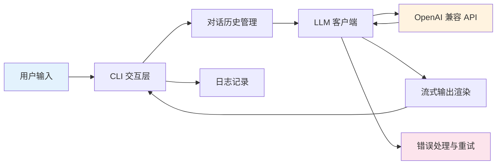

## 前言

这是 Python 课程的最后一章，也是最重要的实战章。我们将综合运用前面 15 章学到的所有知识点——函数、类、requests、JSON、异常处理、asyncio、logging、配置文件、命令行参数——构建一个**功能完整、可实际使用的 LLM 聊天客户端**。

这个项目将涵盖：

- 项目结构设计
- 配置管理（环境变量 + 配置文件）
- 日志系统
- LLM API 客户端封装
- 异步流式输出
- CLI 交互界面
- 对话历史管理
- 多模型支持
- 异常处理与重试



## 一、项目结构

我们先规划项目的整体结构。一个良好的项目结构能让代码更易维护：

```
llm_chat/
├── main.py                 # 程序入口
├── config.py               # 配置管理
├── client.py               # LLM API 客户端
├── engine.py               # 异步聊天引擎
├── chat_ui.py              # CLI 交互界面
├── history.py              # 对话历史管理
├── requirements.txt        # 依赖包
└── .env.example            # 环境变量模板
```

### 1.1 创建项目目录

```bash
# 在项目根目录创建
mkdir llm_chat
cd llm_chat
```

### 1.2 依赖文件

```txt
# requirements.txt
openai>=1.0.0
python-dotenv>=1.0.0
rich>=13.0.0
```

这里我们使用三个核心库：

- **openai**：官方 SDK，支持流式输出和异步调用
- **python-dotenv**：管理 `.env` 环境变量
- **rich**：终端美化库，支持彩色输出、Markdown 渲染、打字机效果

```bash
pip install -r requirements.txt
```

## 二、配置管理

### 2.1 环境变量模板

```bash
# .env.example
OPENAI_API_KEY=sk-your-api-key-here
OPENAI_BASE_URL=https://api.openai.com/v1
MODEL_NAME=gpt-4o
TEMPERATURE=0.7
MAX_TOKENS=2048
```

> **安全提醒**：永远不要将真实的 API Key 提交到代码仓库。`.env` 文件应该加入 `.gitignore`。

### 2.2 配置模块

```python
# config.py
"""
配置管理模块
负责加载 API Key、模型参数等配置信息。
支持从 .env 文件和命令行参数两种方式读取配置。
"""

import os
from dataclasses import dataclass, field
from typing import Optional

# 尝试加载 .env 文件
try:
    from dotenv import load_dotenv
    load_dotenv()  # 自动加载项目根目录的 .env 文件
except ImportError:
    pass  # 如果没装 python-dotenv，就跳过


@dataclass
class Config:
    """聊天客户端的配置类"""

    # API 相关
    api_key: str = field(default_factory=lambda: os.getenv("OPENAI_API_KEY", ""))
    base_url: str = field(default_factory=lambda: os.getenv(
        "OPENAI_BASE_URL", "https://api.openai.com/v1"
    ))
    model_name: str = field(default_factory=lambda: os.getenv(
        "MODEL_NAME", "gpt-4o"
    ))

    # 生成参数
    temperature: float = field(default_factory=lambda: float(os.getenv(
        "TEMPERATURE", "0.7"
    )))
    max_tokens: int = field(default_factory=lambda: int(os.getenv(
        "MAX_TOKENS", "2048"
    )))

    # 系统提示词
    system_prompt: str = field(default_factory=lambda: os.getenv(
        "SYSTEM_PROMPT", "你是一个有帮助的 AI 助手。"
    ))

    # 重试次数
    max_retries: int = field(default_factory=lambda: int(os.getenv(
        "MAX_RETRIES", "3"
    )))

    def validate(self) -> bool:
        """验证配置是否完整"""
        if not self.api_key:
            print("⚠️  警告：未设置 OPENAI_API_KEY")
            print("   请在 .env 文件中配置，或通过命令行参数传入")
            return False
        return True

    def __post_init__(self):
        """初始化后处理：确保 base_url 不以 / 结尾"""
        if self.base_url.endswith("/"):
            self.base_url = self.base_url.rstrip("/")


# 全局配置实例
config = Config()
```

> **关键点**：`@dataclass` 是 Python 3.7 引入的语法糖，自动为我们生成 `__init__`、`__repr__` 等方法。`field(default_factory=...)` 确保每次创建新实例时都有独立的默认值。

## 三、日志系统

### 3.1 日志模块

```python
# logger.py
"""
日志模块
提供统一的日志配置，支持控制台输出和文件记录。
"""

import logging
import sys
from pathlib import Path


def setup_logger(
    name: str = "llm_chat",
    level: str = "INFO",
    log_file: Optional[str] = None,
) -> logging.Logger:
    """
    配置并返回一个 Logger 实例。

    Args:
        name: Logger 名称，通常用模块名
        level: 日志级别，DEBUG/INFO/WARNING/ERROR
        log_file: 日志文件路径，None 则不写入文件

    Returns:
        配置好的 Logger 实例
    """
    logger = logging.getLogger(name)
    logger.setLevel(getattr(logging, level.upper(), logging.INFO))

    # 避免重复添加 handler
    if logger.handlers:
        return logger

    # 格式化器：时间戳 + 级别 + 消息
    formatter = logging.Formatter(
        "[%(asctime)s] %(levelname)-7s %(name)s - %(message)s",
        datefmt="%H:%M:%S",
    )

    # 控制台 Handler（彩色输出）
    console_handler = logging.StreamHandler(sys.stdout)
    console_handler.setFormatter(formatter)
    logger.addHandler(console_handler)

    # 文件 Handler（可选）
    if log_file:
        Path(log_file).parent.mkdir(parents=True, exist_ok=True)
        file_handler = logging.FileHandler(log_file, encoding="utf-8")
        file_handler.setFormatter(formatter)
        logger.addHandler(file_handler)

    return logger


# 便捷函数
def debug(msg: str):
    logging.getLogger("llm_chat").debug(msg)


def info(msg: str):
    logging.getLogger("llm_chat").info(msg)


def warning(msg: str):
    logging.getLogger("llm_chat").warning(msg)


def error(msg: str):
    logging.getLogger("llm_chat").error(msg)
```

### 3.2 日志级别说明

| 级别 | 用途 | 示例 |
|------|------|------|
| DEBUG | 详细调试信息 | 请求的完整 payload |
| INFO | 一般运行信息 | 用户发送消息、收到回复 |
| WARNING | 潜在问题 | API 限速、重试 |
| ERROR | 错误信息 | 请求失败、解析错误 |

## 四、LLM API 客户端

### 4.1 同步客户端

这是最基础的 API 调用封装，理解它是后续异步版本的基础。

```python
# client.py
"""
LLM API 客户端
封装与 OpenAI 兼容 API 的交互逻辑。
同时支持同步和异步两种调用方式。
"""

import json
import time
import logging
from typing import List, Dict, Generator, Optional

import httpx
from openai import OpenAI, AsyncOpenAI, APIError, RateLimitError

from config import Config
from logger import info, warning, error, debug

logger = logging.getLogger("llm_chat")


class ChatClient:
    """
    LLM 聊天客户端

    封装了与 OpenAI 兼容 API 的所有交互，包括：
    - 单次对话请求
    - 流式输出
    - 自动重试
    - 速率限制处理
    """

    def __init__(self, config: Optional[Config] = None):
        self.config = config or Config()
        if not self.config.validate():
            raise ValueError("配置不完整，请检查 API Key")

        # 创建同步客户端
        self.client = OpenAI(
            api_key=self.config.api_key,
            base_url=self.config.base_url,
        )

        # 创建异步客户端
        self.async_client = AsyncOpenAI(
            api_key=self.config.api_key,
            base_url=self.config.base_url,
        )

        # 对话历史（用于维持上下文）
        self.messages: List[Dict[str, str]] = []

    def add_message(self, role: str, content: str):
        """添加一条消息到对话历史"""
        self.messages.append({"role": role, "content": content})

    def clear_history(self):
        """清空对话历史"""
        self.messages.clear()

    def chat(
        self,
        user_message: str,
        system_prompt: Optional[str] = None,
        temperature: Optional[float] = None,
        max_tokens: Optional[int] = None,
    ) -> str:
        """
        发送对话请求，返回完整回复。

        Args:
            user_message: 用户消息
            system_prompt: 系统提示词（覆盖默认配置）
            temperature: 温度参数（0-2，越高越随机）
            max_tokens: 最大回复长度

        Returns:
            LLM 的回复文本
        """
        # 构建消息列表
        messages = []
        if system_prompt:
            messages.append({"role": "system", "content": system_prompt})
        elif self.config.system_prompt:
            messages.append({"role": "system", "content": self.config.system_prompt})

        # 添加历史对话
        messages.extend(self.messages)

        # 添加当前用户消息
        messages.append({"role": "user", "content": user_message})

        # 发送请求（带重试）
        response_text = self._request_with_retry(messages, temperature, max_tokens)

        # 保存对话到历史
        self.add_message("user", user_message)
        self.add_message("assistant", response_text)

        info(f"收到回复，长度：{len(response_text)} 字符")
        return response_text

    def _request_with_retry(
        self,
        messages: List[Dict],
        temperature: Optional[float] = None,
        max_tokens: Optional[int] = None,
    ) -> str:
        """
        带重试机制的请求方法。

        遇到 RateLimitError 时指数退避重试，遇到其他错误直接抛出。
        """
        last_error = None

        for attempt in range(1, self.config.max_retries + 1):
            try:
                response = self.client.chat.completions.create(
                    model=self.config.model_name,
                    messages=messages,
                    temperature=temperature or self.config.temperature,
                    max_tokens=max_tokens or self.config.max_tokens,
                    stream=False,
                )

                # 解析响应
                if response.choices:
                    return response.choices[0].message.content or ""

                return ""

            except RateLimitError as e:
                last_error = e
                wait_time = 2 ** attempt  # 指数退避：2s, 4s, 8s...
                warning(f"触发速率限制，{wait_time}s 后重试 ({attempt}/{self.config.max_retries})")
                time.sleep(wait_time)

            except APIError as e:
                error(f"API 错误：{e}")
                raise

        # 所有重试都失败了
        raise RateLimitError(f"重试 {self.config.max_retries} 次后仍然失败：{last_error}")

    def chat_stream(
        self,
        user_message: str,
        system_prompt: Optional[str] = None,
    ) -> Generator[str, None, None]:
        """
        流式对话请求，逐 token 返回。

        使用生成器实现，可以在收到第一个 token 时就显示给用户。

        Yields:
            每个 token 的文本片段
        """
        messages = []
        if system_prompt:
            messages.append({"role": "system", "content": system_prompt})
        elif self.config.system_prompt:
            messages.append({"role": "system", "content": self.config.system_prompt})

        messages.extend(self.messages)
        messages.append({"role": "user", "content": user_message})

        try:
            stream = self.client.chat.completions.create(
                model=self.config.model_name,
                messages=messages,
                temperature=self.config.temperature,
                max_tokens=self.config.max_tokens,
                stream=True,  # 启用流式
            )

            full_response = []

            for chunk in stream:
                if chunk.choices and chunk.choices[0].delta.content:
                    token = chunk.choices[0].delta.content
                    full_response.append(token)
                    yield token  # 逐 token 产出

            # 保存完整对话
            response_text = "".join(full_response)
            self.add_message("user", user_message)
            self.add_message("assistant", response_text)

            debug(f"流式输出完成，总长度：{len(response_text)} 字符")

        except APIError as e:
            error(f"流式请求失败：{e}")
            raise

    def switch_model(self, model_name: str) -> bool:
        """
        切换模型。

        Args:
            model_name: 模型名称，如 gpt-4o、claude-3-opus 等

        Returns:
            切换是否成功
        """
        old_model = self.config.model_name
        self.config.model_name = model_name

        # 重新创建客户端以应用新的 base_url（不同模型可能用不同的 endpoint）
        try:
            self.client = OpenAI(
                api_key=self.config.api_key,
                base_url=self.config.base_url,
            )
            self.async_client = AsyncOpenAI(
                api_key=self.config.api_key,
                base_url=self.config.base_url,
            )
            info(f"模型已从 {old_model} 切换到 {model_name}")
            return True
        except Exception as e:
            self.config.model_name = old_model
            error(f"模型切换失败：{e}")
            return False
```

### 4.2 关键设计说明

**为什么同时提供同步和异步？**

- 同步方法 (`chat`) 简单直观，适合快速原型和调试
- 流式方法 (`chat_stream`) 提供更好的用户体验，用户能实时看到回复
- 两者共享相同的重试和错误处理逻辑

**消息格式详解：**

```python
# LLM API 的消息格式
messages = [
    {"role": "system", "content": "你是 helpful assistant"},  # 系统设定
    {"role": "user", "content": "你好"},                       # 用户消息
    {"role": "assistant", "content": "你好！有什么可以帮助你的？"},  # AI 回复
    {"role": "user", "content": "介绍一下 Python"},            # 下一轮用户消息
]
```

三个角色：
- `system`：设定 AI 的行为和风格，只在开头出现一次
- `user`：用户的输入
- `assistant`：AI 的回复

## 五、异步聊天引擎

### 5.1 引擎模块

这一层将客户端和 UI 解耦，负责协调异步操作。

```python
# engine.py
"""
异步聊天引擎
协调客户端、UI 和历史记录的异步操作。
"""

import asyncio
import logging
from typing import Optional

from openai import APIError, RateLimitError

from client import ChatClient
from config import Config
from history import ChatHistory
from logger import info, warning, error

logger = logging.getLogger("llm_chat")


class ChatEngine:
    """
    聊天引擎

    核心调度器，管理整个聊天流程：
    1. 加载对话历史
    2. 发送请求给 LLM
    3. 保存新对话
    4. 处理异常
    """

    def __init__(self, config: Optional[Config] = None):
        self.config = config or Config()
        self.client = ChatClient(self.config)
        self.history = ChatHistory()  # 持久化历史记录

        # 加载之前的对话历史
        self._load_history()

    def _load_history(self):
        """从文件加载对话历史到内存"""
        loaded_messages = self.history.load()
        if loaded_messages:
            self.client.messages = loaded_messages
            info(f"已加载 {len(loaded_messages)} 条历史记录")

    def _save_history(self):
        """将当前对话历史保存到文件"""
        self.history.save(self.client.messages)

    async def chat_async(
        self,
        user_message: str,
        stream: bool = True,
    ):
        """
        异步聊天入口。

        Args:
            user_message: 用户输入的消息
            stream: 是否使用流式输出

        Raises:
            RuntimeError: API 调用失败时抛出
        """
        if not user_message.strip():
            return

        try:
            if stream:
                # 流式输出：逐 token 打印
                full_response = await self._stream_chat(user_message)
            else:
                # 完整输出：一次性返回
                full_response = await self._full_chat(user_message)

            # 保存对话历史
            self._save_history()
            return full_response

        except RateLimitError as e:
            error(f"速率限制：{e}")
            print("\n❌ 请求过于频繁，请稍后再试")
            return None

        except APIError as e:
            error(f"API 错误：{e}")
            print(f"\n❌ API 调用失败：{e}")
            return None

        except Exception as e:
            error(f"未知错误：{e}", exc_info=True)
            print(f"\n❌ 发生错误：{e}")
            return None

    async def _full_chat(self, user_message: str) -> str:
        """非流式完整聊天"""
        info(f"用户: {user_message[:50]}{'...' if len(user_message) > 50 else ''}")

        loop = asyncio.get_event_loop()
        response = await loop.run_in_executor(
            None,
            lambda: self.client.chat(user_message)
        )

        return response

    async def _stream_chat(self, user_message: str) -> str:
        """流式聊天"""
        info(f"用户: {user_message[:50]}{'...' if len(user_message) > 50 else ''}")

        full_response = []
        loop = asyncio.get_event_loop()

        # 在后台线程中执行流式生成
        stream_gen = self.client.chat_stream(user_message)

        for token in stream_gen:
            full_response.append(token)
            print(token, end="", flush=True)

        print()  # 换行
        return "".join(full_response)

    def clear_chat(self):
        """清空对话并重置"""
        self.client.clear_history()
        self.history.clear()
        info("对话已清空")

    def show_history(self):
        """显示最近 N 条对话"""
        messages = self.history.load()[-10:]  # 最近 10 条
        if not messages:
            print("暂无对话历史")
            return

        print("\n📜 最近对话：")
        print("-" * 50)
        for msg in messages:
            role_emoji = {"user": "👤", "assistant": "🤖", "system": "⚙️"}.get(
                msg["role"], "?"
            )
            content_preview = msg["content"][:80]
            if len(msg["content"]) > 80:
                content_preview += "..."
            print(f"{role_emoji} [{msg['role']}]: {content_preview}")
        print("-" * 50)

    def get_available_models(self) -> list:
        """获取可用的模型列表"""
        # 这里可以调用 API 列出可用模型
        # 为了简化，返回常见模型列表
        common_models = [
            "gpt-4o",
            "gpt-4o-mini",
            "gpt-4-turbo",
            "gpt-4",
            "claude-3-opus",
            "claude-3-sonnet",
        ]
        return common_models
```

### 5.2 异步与同步的桥接

注意 `_full_chat` 中使用了一个技巧：

```python
loop = asyncio.get_event_loop()
response = await loop.run_in_executor(
    None,
    lambda: self.client.chat(user_message)
)
```

这是因为 `client.chat()` 是同步方法，但在异步上下文中调用会阻塞事件循环。`run_in_executor` 将其放到线程池中执行，避免阻塞。

## 六、对话历史管理

### 6.1 历史记录模块

```python
# history.py
"""
对话历史管理
负责将对话持久化到本地 JSON 文件。
"""

import json
import logging
from pathlib import Path
from typing import List, Dict, Optional

logger = logging.getLogger("llm_chat")

# 历史记录存储路径
HISTORY_FILE = Path("chat_history.json")


class ChatHistory:
    """
    对话历史管理器

    使用 JSON 文件持久化存储对话记录。
    支持加载、保存、清空和查询操作。
    """

    def __init__(self, filepath: Optional[Path] = None):
        self.filepath = filepath or HISTORY_FILE

    def load(self) -> List[Dict[str, str]]:
        """
        从文件加载对话历史。

        Returns:
            消息列表，格式为 [{"role": "user", "content": "..."}, ...]
            如果文件不存在或格式错误，返回空列表
        """
        if not self.filepath.exists():
            return []

        try:
            with open(self.filepath, "r", encoding="utf-8") as f:
                data = json.load(f)

            # 验证数据结构
            if isinstance(data, list):
                for msg in data:
                    if not isinstance(msg, dict):
                        raise ValueError("消息格式不正确")
                    if "role" not in msg or "content" not in msg:
                        raise ValueError("消息缺少必要字段")

                logger.info(f"加载了 {len(data)} 条历史记录")
                return data

            return []

        except json.JSONDecodeError as e:
            logger.warning(f"历史文件格式错误：{e}")
            return []
        except Exception as e:
            logger.error(f"加载历史失败：{e}")
            return []

    def save(self, messages: List[Dict[str, str]]):
        """
        保存对话历史到文件。

        Args:
            messages: 要保存的消息列表
        """
        try:
            # 确保父目录存在
            self.filepath.parent.mkdir(parents=True, exist_ok=True)

            with open(self.filepath, "w", encoding="utf-8") as f:
                json.dump(messages, f, ensure_ascii=False, indent=2)

            logger.debug(f"保存了 {len(messages)} 条消息到 {self.filepath}")

        except Exception as e:
            logger.error(f"保存历史失败：{e}")

    def clear(self):
        """清空历史文件"""
        if self.filepath.exists():
            try:
                self.filepath.unlink()
                logger.info("历史文件已删除")
            except Exception as e:
                logger.error(f"清空历史失败：{e}")

    def get_last_n(self, n: int = 10) -> List[Dict[str, str]]:
        """获取最近 N 条消息"""
        messages = self.load()
        return messages[-n:] if messages else []
```

## 七、CLI 交互界面

### 7.1 界面模块

使用 `rich` 库打造美观的终端界面。

```python
# chat_ui.py
"""
CLI 聊天界面
提供用户交互层，处理输入、输出和快捷键。
"""

import logging
from typing import Optional

from rich.console import Console
from rich.panel import Panel

from engine import ChatEngine
from config import Config

logger = logging.getLogger("llm_chat")
console = Console()


class ChatUI:
    """
    CLI 聊天界面

    提供：
    - 美观的对话气泡展示
    - Markdown 渲染
    - 快捷键支持
    - 命令解析
    """

    # 支持的快捷键命令
    COMMANDS = {
        "/clear": "清空对话",
        "/history": "查看对话历史",
        "/model": "查看/切换模型",
        "/quit": "退出程序",
        "/exit": "退出程序",
        "/help": "显示帮助信息",
    }

    def __init__(self, engine: Optional[ChatEngine] = None, config: Optional[Config] = None):
        self.engine = engine or ChatEngine(config)
        self.config = self.engine.config

    def start(self):
        """启动聊天界面"""
        self._show_welcome()

        try:
            while True:
                # 获取用户输入
                user_input = self._get_user_input()

                # 处理命令
                if self._handle_command(user_input):
                    continue

                # 发送给 LLM
                self._send_message(user_input)

        except KeyboardInterrupt:
            print("\n\n👋 再见！")
        except EOFError:
            print("\n\n👋 再见！")

    def _show_welcome(self):
        """显示欢迎信息"""
        console.print()
        console.print(Panel.fit(
            "🤖 LLM 聊天客户端",
            style="bold cyan",
            border_style="cyan",
        ))
        console.print()
        console.print(f"  模型：[bold]{self.config.model_name}[/bold]")
        console.print(f"  API：  [dim]{self.config.base_url}[/dim]")
        console.print()
        console.print("  输入 [bold]help[/bold] 查看可用命令")
        console.print("  按 [bold]Ctrl+C[/bold] 退出")
        console.print()

    def _get_user_input(self) -> str:
        """
        获取用户输入。

        Returns:
            用户输入的文本
        """
        try:
            # 使用 rich 美化输入提示
            user_input = console.input(
                "[bold green]你:[/boldgreen] "
            )
            return user_input
        except EOFError:
            return "/quit"

    def _handle_command(self, text: str) -> bool:
        """
        处理用户命令。

        Args:
            text: 用户输入的文本

        Returns:
            如果命令是 quit/exit，返回 True 终止循环
        """
        text = text.strip()

        if text == "/quit" or text == "/exit":
            self.engine._save_history()
            return True

        elif text == "/clear":
            self.engine.clear_chat()
            console.print(Panel("对话已清空", style="green"))
            return True

        elif text == "/history":
            self.engine.show_history()
            return True

        elif text == "/model":
            self._show_model_menu()
            return True

        elif text == "/help":
            self._show_help()
            return True

        # 不是命令，返回 False 继续正常聊天流程
        return False

    def _show_model_menu(self):
        """显示模型菜单"""
        models = self.engine.get_available_models()
        current = self.config.model_name

        console.print()
        console.print(Panel(
            f"当前模型：[bold green]{current}[/bold green]\n\n"
            "可用模型：\n" +
            "\n".join(f"  {i+1}. {m}" for i, m in enumerate(models)),
            title="📦 模型列表",
            border_style="blue",
        ))
        console.print()
        console.print("  输入 [/model <模型名>] 切换模型，例如：[/] [/model gpt-4o-mini]")

    def _show_help(self):
        """显示帮助信息"""
        help_text = []
        for cmd, desc in self.COMMANDS.items():
            help_text.append(f"  {cmd:<10} {desc}")

        console.print(Panel(
            "\n".join(help_text),
            title="📖 可用命令",
            border_style="yellow",
        ))

    def _send_message(self, message: str):
        """
        发送消息给 LLM 并展示回复。

        Args:
            message: 用户消息
        """
        # 检查是否是切换模型的命令
        if message.startswith("/model "):
            model_name = message[7:].strip()
            if self.engine.client.switch_model(model_name):
                self.config.model_name = model_name
            return

        # 发送消息并获取回复
        self._send_message_sync(message)

    def _send_message_sync(self, message: str):
        """同步发送消息——在当前线程中运行异步引擎"""
        import asyncio
        try:
            asyncio.run(self.engine.chat_async(message, stream=True))
        except Exception as e:
            console.print(f"\n[red]❌ 发送失败：{e}[/red]")
```

## 八、主入口

### 8.1 完整的主程序

将以上所有模块组合在一起，用 `asyncio.run()` 作为入口，彻底避免同步/异步混用的问题。

```python
# main.py
"""
LLM 聊天客户端 - 主入口

综合运用：
- 配置管理 (config.py)
- 日志系统 (logger.py)
- API 客户端 (client.py)
- 异步引擎 (engine.py)
- CLI 界面 (chat_ui.py)
- 历史记录 (history.py)

使用方法：
    python main.py                  # 使用默认配置
    python main.py --model gpt-4    # 指定模型
    python main.py --no-stream      # 关闭流式输出
"""

import argparse
import logging
import sys

from config import Config
from engine import ChatEngine
from chat_ui import ChatUI
from logger import setup_logger


def parse_args():
    """
    解析命令行参数。

    支持的参数：
    --model: 指定模型名称
    --base-url: 指定 API 地址
    --no-stream: 关闭流式输出
    --temperature: 设置温度参数
    --max-tokens: 设置最大 token 数
    --log-level: 日志级别 (DEBUG/INFO/WARNING/ERROR)
    --log-file: 日志文件路径
    """
    parser = argparse.ArgumentParser(
        description="LLM 聊天客户端 - 命令行聊天工具",
        formatter_class=argparse.RawDescriptionHelpFormatter,
        epilog="""
示例:
  python main.py                          # 使用默认配置
  python main.py --model gpt-4o-mini      # 指定模型
  python main.py --base-url http://localhost:8080/v1  # 本地部署
  python main.py --temperature 0.3        # 降低创造性
  python main.py --log-level DEBUG        # 开启调试日志
        """,
    )

    parser.add_argument("--model", type=str, help="模型名称，如 gpt-4o、gpt-4o-mini")
    parser.add_argument("--base-url", type=str, help="API 基础地址")
    parser.add_argument("--no-stream", action="store_true", help="关闭流式输出")
    parser.add_argument("--temperature", type=float, help="温度参数 (0-2)")
    parser.add_argument("--max-tokens", type=int, help="最大回复 token 数")
    parser.add_argument("--system-prompt", type=str, help="自定义系统提示词")
    parser.add_argument("--log-level", type=str, default="INFO",
                        choices=["DEBUG", "INFO", "WARNING", "ERROR"],
                        help="日志级别")
    parser.add_argument("--log-file", type=str, help="日志文件路径")

    return parser.parse_args()


def main():
    """主函数：组装并启动聊天客户端"""

    # 1. 解析命令行参数
    args = parse_args()

    # 2. 初始化日志
    setup_logger(
        level=args.log_level,
        log_file=args.log_file,
    )
    logger = logging.getLogger("llm_chat")
    logger.info("=" * 50)
    logger.info("LLM 聊天客户端启动")
    logger.info("=" * 50)

    # 3. 加载配置
    config = Config()

    # 命令行参数覆盖配置文件
    if args.model:
        config.model_name = args.model
    if args.base_url:
        config.base_url = args.base_url
    if args.temperature is not None:
        config.temperature = args.temperature
    if args.max_tokens:
        config.max_tokens = args.max_tokens
    if args.system_prompt:
        config.system_prompt = args.system_prompt

    # 4. 验证配置
    if not config.validate():
        logger.error("配置验证失败，请检查 .env 文件或命令行参数")
        sys.exit(1)

    # 5. 创建引擎和 UI
    engine = ChatEngine(config)
    ui = ChatUI(engine, config)

    # 6. 启动聊天
    ui.start()


if __name__ == "__main__":
    try:
        main()
    except KeyboardInterrupt:
        print("\n程序被用户中断")
        sys.exit(0)
```

## 九、运行指南

### 9.1 首次运行

```bash
# 1. 克隆或创建项目
mkdir llm_chat && cd llm_chat

# 2. 安装依赖
pip install -r requirements.txt

# 3. 配置环境变量
copy .env.example .env    # Windows
# 或
cp .env.example .env      # macOS/Linux

# 编辑 .env 文件，填入你的 API Key
# OPENAI_API_KEY=sk-your-actual-key-here

# 4. 运行
python main.py
```

### 9.2 使用本地 API（Ollama / vLLM）

如果你使用本地部署的 LLM（如 Ollama），只需修改 `base_url`：

```bash
# .env 配置
OPENAI_BASE_URL=http://localhost:11434/v1
MODEL_NAME=qwen2.5:7b

# 运行
python main.py
```

### 9.3 常用命令行参数

```bash
# 指定模型
python main.py --model gpt-4o-mini

# 使用本地 API
python main.py --base-url http://localhost:11434/v1 --model llama3

# 调试模式（查看详细日志）
python main.py --log-level DEBUG

# 设置较低的创造性
python main.py --temperature 0.2 --max-tokens 512
```

### 9.4 内置命令

在聊天过程中，输入以下命令：

| 命令 | 功能 |
|------|------|
| `/clear` | 清空当前对话 |
| `/history` | 查看最近 10 条对话 |
| `/model` | 查看/切换模型 |
| `/help` | 显示帮助信息 |
| `/quit` 或 `/exit` | 退出程序 |

## 十、完整代码一览

为了方便你对照，下面是整个项目的完整文件结构：

```
llm_chat/
├── main.py                 # 主入口（~90 行）
├── config.py               # 配置管理（~70 行）
├── client.py               # API 客户端（~150 行）
├── engine.py               # 异步引擎（~120 行）
├── chat_ui.py              # CLI 界面（~180 行）
├── history.py              # 历史记录（~80 行）
├── logger.py               # 日志模块（~55 行）
├── requirements.txt        # 依赖（3 个包）
└── .env.example            # 环境变量模板
```

**总代码量：约 745 行**

这些代码综合运用了前面所有章节的知识：

| 章节 | 用到的知识点 | 对应文件 |
|------|-------------|---------|
| Ch3 流程控制 | `if/elif/else`, `while`, `for` | 全部 |
| Ch4 函数与模块 | 函数定义、参数传递、模块导入 | 全部 |
| Ch5 字符串处理 | f-string、字符串方法 | config.py, chat_ui.py |
| Ch6 列表与元组 | 列表操作、列表推导式 | client.py, engine.py |
| Ch7 字典与集合 | 字典操作、JSON 数据 | history.py, client.py |
| Ch8 文件与异常 | 文件读写、try/except | history.py, logger.py |
| Ch9 面向对象 | class、dataclass、继承 | 全部核心模块 |
| Ch10 迭代器与生成器 | generator、yield | client.py (chat_stream) |
| Ch11 装饰器与上下文管理器 | @dataclass、with 语句 | config.py, history.py |
| Ch12 标准库精选 | logging、json、pathlib、argparse | 全部 |
| Ch13 并发编程 | asyncio、async/await、gather | engine.py, client.py |
| Ch14 网络请求与API | requests/httpx、REST API | client.py |
| Ch15 JSON与数据处理 | JSON 序列化/反序列化 | history.py, config.py |

## 十一、扩展方向

这个项目已经是一个功能完整的聊天客户端，但还有很多可以继续探索的方向：

### 11.1 增加图片输入

```python
# 支持多模态模型（如 gpt-4o）的图片输入
def chat_with_image(self, user_message: str, image_base64: str):
    """发送包含图片的消息"""
    messages = [
        {"role": "user", "content": [
            {"type": "text", "text": user_message},
            {
                "type": "image_url",
                "image_url": {"url": f"data:image/jpeg;base64,{image_base64}"}
            },
        ]}
    ]
    # ... 发送请求
```

### 11.2 增加函数调用

```python
# 支持 LLM 调用外部函数
def chat_with_tools(self, user_message: str, tools: list):
    """使用函数调用的对话"""
    response = self.client.chat.completions.create(
        model=self.config.model_name,
        messages=[{"role": "user", "content": user_message}],
        tools=tools,  # 定义可用函数
    )
    
    # 如果 LLM 要求调用函数
    if response.choices[0].finish_reason == "tool_calls":
        tool_call = response.choices[0].message.tool_calls[0]
        result = self._execute_tool(tool_call)
        # 将结果发给 LLM
        return self._get_final_answer(result)
```

### 11.3 增加 RAG（检索增强生成）

```python
# 结合向量数据库实现知识库问答
from langchain.vectorstores import Chroma
from langchain.embeddings import OpenAIEmbeddings

def rag_chat(self, user_message: str, documents: list) -> str:
    """基于文档的问答"""
    # 1. 将文档向量化
    vectorstore = Chroma.from_documents(documents, OpenAIEmbeddings())
    
    # 2. 检索相关文档
    relevant_docs = vectorstore.similarity_search(user_message, k=3)
    
    # 3. 构建增强提示
    context = "\n".join(doc.page_content for doc in relevant_docs)
    prompt = f"基于以下资料回答问题：\n\n{context}\n\n问题：{user_message}"
    
    # 4. 发送给 LLM
    return self.client.chat(prompt)
```

## 十二、本章小结

| 概念 | 要点 | 对应章节 |
|------|------|---------|
| 项目结构 | 模块化设计，单一职责 | 本章 |
| 配置管理 | dataclass + 环境变量 + 命令行参数 | Ch4, Ch7, Ch12 |
| 日志系统 | logging 模块 + 多级日志 | Ch12 |
| API 客户端 | OpenAI SDK + 重试 + 速率限制 | Ch14 |
| 流式输出 | generator + yield 逐 token 返回 | Ch10 |
| 异步编程 | asyncio + async/await 非阻塞 I/O | Ch13 |
| 历史记录 | JSON 持久化 + 数据验证 | Ch7, Ch15 |
| CLI 界面 | rich 库美化终端输出 | 本章 |
| 命令行参数 | argparse 解析参数 | Ch12 |
| 错误处理 | 分级捕获 + 指数退避重试 | Ch8 |

## 十三、练习

### 基础题

1. **运行项目**：按照指南搭建环境，成功运行聊天客户端，与 LLM 进行至少 5 轮对话

2. **添加新功能**：在 `ChatUI` 中添加一个 `/save` 命令，将当前对话导出为 Markdown 文件

3. **修改样式**：使用 rich 的 `Table` 组件，在 `/model` 命令中显示模型对比表格（名称、速度、价格）

### 进阶题

4. **多轮对话优化**：当前的对话历史会无限增长。实现一个滑动窗口机制，只保留最近的 N 轮对话，避免 token 超限

5. **并发对话**：使用 `asyncio.gather` 同时向两个不同的模型发送同一问题，比较它们的回答

6. **自定义系统提示词**：实现一个 `/system` 命令，允许用户在对话中动态修改系统提示词

### 挑战题

7. **语音输入**：使用 `speech_recognition` 库实现语音输入，将语音转为文字后发送给 LLM

8. **TUI 界面**：使用 `textual` 或 `curses` 库替换简单的 CLI，实现类似网页聊天的气泡界面

9. **插件系统**：设计一个插件架构，允许用户通过注册回调函数来扩展功能（如自动翻译、摘要生成等）

10. **完整的产品级客户端**：整合以上所有扩展方向，添加单元测试（`unittest`）、CI/CD 流水线、Docker 部署配置

---

> 🎉 **恭喜你完成了 Python 课程！** 从第一个 `print("Hello World")` 到这个完整的 LLM 聊天客户端，你已经掌握了 Python 开发的核心理念。接下来，你可以：
> - 继续探索 AI/ML 领域（下一章课程见）
> - 将这个客户端部署到服务器，随时与 LLM 对话
> - 参考开源项目，学习更多工程实践
